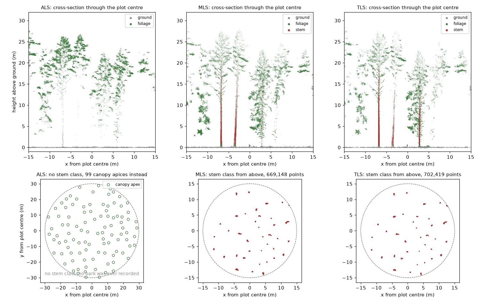
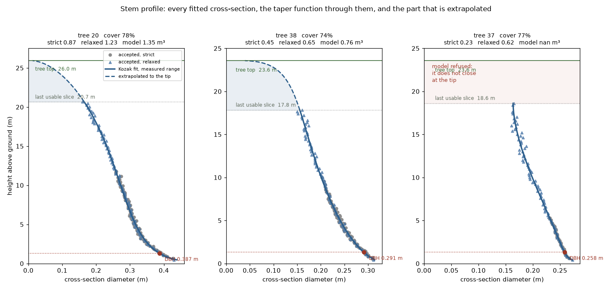
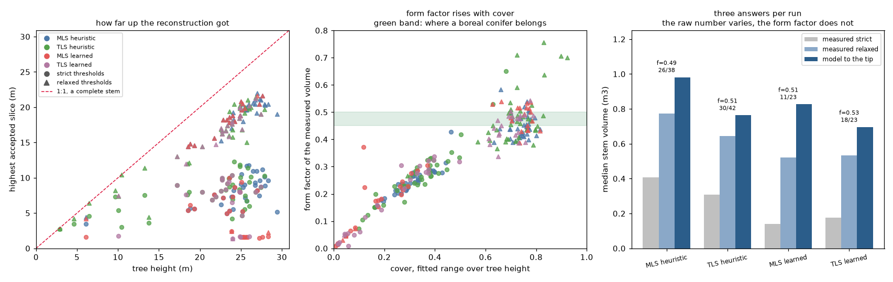
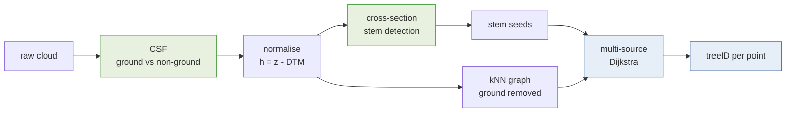

# NOVA course 2026 - point cloud tooling

My own take on the problems covered on **Day 3** (2026-08-19) and **Day 4**
(2026-08-20) of the NOVA PhD course *Introduction to Point Cloud Processing for Forest
Sciences*, written as [marimo](https://marimo.io) notebooks and a small Python
library.

> **This is student work, not course material.** I took the course as a participant.
> These are **not** the course instructions, and they deliberately do not follow them
> step for step - the demo runs interactively in CloudCompare and the Windows-only
> `PCT_demo.exe`, whereas this is an independent implementation in reproducible
> Python. Where I diverged from the taught approach, or measured something the course
> did not, that is my own choice and my own responsibility.
>
> Nothing here is endorsed by, or speaks for, the course organisers or NOVA. For the
> actual course content, go to the organisers.

It covers the same ground - CSF ground filtering, height normalisation, cross-section
stem detection, 3D Dijkstra region growing, stem taper reconstruction, and on Day 4 the
same plot from three platforms at once - and scores each method against the reference
labels that ship with the course data, which is the part I was most interested in.

**No data is tracked here.** Point clouds (`*.laz`), slides and the `PCT_demo` bundle
are excluded by `.gitignore`. Re-fetch the course material from the organisers;
regenerate derived products with the scripts here.

## What it produces



Ground, stem and foliage on the same plot from a helicopter, a mobile scanner and a
tripod. The ALS panel has **no stem class in it**, because a helicopter never records
bark, and the rings in its plan view are canopy apices standing twenty metres above
the stems they belong to. That difference is the reason the Day 4 exercise exists.



Every fitted cross-section for three stems, the Kozak taper through them, and the part
that is extrapolated above the last usable slice. DBH is read from the curve at 1.3 m
rather than from any one slice. The third panel is a fit being **refused**: it does not
close at the tip, so integrating it would charge a 0.16 m cylinder from 18.6 m to the
treetop as stem volume.



Why there are three volume columns rather than one. The middle panel is the argument:
the form factor of a measured volume rises with how much of the stem was reconstructed
and only reaches the boreal band as cover approaches one.

More figures, and the numbers behind them, are in the day READMEs:
[Day 3](notebooks/day03/README.md) and [Day 4](notebooks/day04/README.md). What the
whole exercise taught, rule by rule with the mistake behind each one, is collected in
[**best practices**](docs/best-practices.md).

## The course

**Introduction to Point Cloud Processing for Forest Sciences** - SLU course code
[P000158](https://www.slu.se/en/student-web/studies/courses-and-programmes/course-search/kurser/i/introduction-to-point-cloud-processing-for-forest-sciences/).

| | |
| --- | --- |
| Organised by | Swedish University of Agricultural Sciences (SLU), Department of Forest Resource Management |
| Location | Flämslätt and Remningstorp, Sweden, plus digital meetings |
| Level | Postgraduate / doctoral, third cycle (EQF level 8) |
| Credits | 3 ECTS (NOVA listing) · 4.5 Hp (SLU syllabus) |
| Term | 2026-05-18 to 2026-09-30 |
| Teaching | Blended, in person and online |
| Language | English |
| Course coordinator | Eva Lindberg |

The course covers processing of high-resolution point clouds from laser scanning and
digital photogrammetry: filtering and classification, surface normals and surface
models, conditional Euclidean clustering, and segmentation of tree crowns and stems by
both classical and AI methods, over 3D coordinates, 3D voxels and 2D pixels.

This repository touches the Day 3 close-range-sensing material and the Day 4
multi-sensor exercise, and only the parts I chose to reimplement.

## About NOVA

The **Nordic Forestry, Veterinary and Agricultural University Network (NOVA)** is a
university cooperation supporting the understanding of major global challenges in a
Nordic context. It provides PhD-level courses in agricultural, forestry and veterinary
sciences, and supports doctoral students, post-graduate veterinary specialisation
students and NOVA scientists in building international scientific networks.

Member universities:

| | |
| --- | --- |
| **SLU** | Sveriges lantbruksuniversitet - Swedish University of Agricultural Sciences, Sweden |
| **NMBU** | Norges miljø- og biovitenskapelige universitet - Norwegian University of Life Sciences, Norway |
| **LBHÍ** | Landbúnaðarháskóli Íslands - Agricultural University of Iceland, Iceland |
| **UEF** | Itä-Suomen Yliopisto, School of Forest Sciences - University of Eastern Finland |
| **UH-V** | Helsingin yliopisto, Eläinlääketieteellinen tiedekunta - University of Helsinki, Faculty of Veterinary Medicine, Finland |
| **UH-AF** | Helsingin yliopisto, Maatalous-metsätieteellinen tiedekunta - University of Helsinki, Faculty of Agriculture and Forestry, Finland |

More about NOVA: <https://www.lbhi.is/nova>

## Author

**José M. Beltrán-Abaunza, PhD**
[](https://orcid.org/0000-0003-3777-6788)
[](https://github.com/jobelab)

Sr. Research Engineer, Department of Earth and Environmental Sciences,
Lund University, Sweden

Main author and maintainer. Participating in the course as a student; this repository
is personal work done alongside it, in no official capacity.

**Contributors:** none yet. Issues, corrections and pull requests are welcome - this is
open science, and the measurements here would benefit from more eyes on them. Anyone
who contributes will be listed here and in [`NOTICE`](NOTICE).

## Acknowledgements

This repository ports, wraps or builds on the work below. **None of these authors
contributed code here**, and any errors in this implementation are mine alone.

| work | authors | how it is used |
| --- | --- | --- |
| [**Point-Cloud-Tools (PCT)**](https://github.com/tuomasyr/Point-Cloud-Tools) | Dr. Tuomas Yrttimaa, University of Eastern Finland | `novatrees.chm_watershed` is a Python port of the crown-detection stage. CC BY 4.0. Cite [Yrttimaa 2021](https://doi.org/10.5281/zenodo.5779288), [Yrttimaa et al. 2019](https://doi.org/10.3390/rs11121423), [2020](https://doi.org/10.1016/j.isprsjprs.2020.08.017) |
| [**TreeAIBox / TreeisoNet**](https://github.com/NRCan/TreeAIBox) | Zhouxin Xi & Dani Degenhardt, Canadian Forest Service, Natural Resources Canada | driven directly for learned stem classification and tree location. [Xi & Degenhardt 2025](https://www.sciencedirect.com/science/article/pii/S266739322500002X) |
| [**3DFin**](https://github.com/3DFin/3DFin) and [**dendromatics**](https://github.com/3DFin/dendromatics) | the 3DFin developers | driven by `novatrees.dfin_bridge` as a third detection method, at their own defaults. Their locally-tracked-axis idea is where `extract.track_stem_axis` came from |
| [**CSF**](https://github.com/jianboqi/CSF) | Wuming Zhang, Jianbo Qi et al. | ground filtering. [Zhang et al. 2016](https://doi.org/10.3390/rs8060501) |
| [**CloudCompare**](https://www.cloudcompare.org/) and [CloudCompare-PythonRuntime](https://github.com/tmontaigu/CloudCompare-PythonRuntime) | Daniel Girardeau-Montaut; Thomas Montaigu | the host application and its Python runtime |
| [**marimo**](https://marimo.io) | the marimo developers | the reactive notebook format |

The course and its Day 3 demo are the work of the organisers at SLU, with the
close-range-sensing session taught by Tuomas Yrttimaa. The approach implemented here
was learned from that session; the implementation, and any departures from it, are
mine.

## Citation

Chicago (author-date):

> Beltrán-Abaunza, José M. 2026. "NOVA Course 2026 - Point Cloud Tooling."
> Lund University. https://github.com/jobelab/nova-course-2026.

BibTeX:

```bibtex
@software{beltranabaunza_2026_novapointcloud,
  author  = {Beltr{\'a}n-Abaunza, Jos{\'e} M.},
  title   = {{NOVA} course 2026 --- point cloud tooling},
  year    = {2026},
  url     = {https://github.com/jobelab/nova-course-2026},
  license = {GPL-3.0-or-later},
  note    = {Department of Earth and Environmental Sciences,
             Lund University, Sweden. ORCID: 0000-0003-3777-6788}
}
```

[`CITATION.cff`](CITATION.cff) carries the same metadata in machine-readable form, so
GitHub shows a **Cite this repository** button and Zenodo can pick it up if this is
ever archived with a DOI.

If you cite the methods rather than this implementation, cite the original authors in
[Acknowledgements](#acknowledgements) instead - the ideas are theirs.

## Licence

[](https://www.gnu.org/licenses/gpl-3.0)

**GNU General Public License v3.0 or later** (SPDX: `GPL-3.0-or-later`) - see
[`LICENSE`](LICENSE) for the full text and [`NOTICE`](NOTICE) for authorship and
attribution.

Released as open science: free to read, run, adapt and build on, with the same freedoms
required of anything derived from it. Source files carry an SPDX identifier and an
author line rather than a copyright banner - the licence is what governs reuse, and the
authorship is what should be cited.

### Why GPL over the CC BY it derives from

`src/novatrees/chm_watershed.py` ports part of Yrttimaa's Point-Cloud-Tools, which is
CC BY 4.0. CC BY explicitly permits distributing adapted material under the adapter's
own terms (§3(a)) so long as attribution is given and the original licence identified,
so a GPL-3.0 derivative is allowed. GPL is the better fit here because this is
software, and CC licences are not written for code - they say nothing about source
availability, linking, or patents.

Two things this does **not** do: it does not relicense Yrttimaa's original work, which
remains CC BY 4.0 at source; and it does not remove the attribution obligation, which
travels with any redistribution. Both are recorded in [`NOTICE`](NOTICE).

## Layout

    src/novatrees/     the Python library, see the module table below
    notebooks/         02_methods_and_equations.py, shared across days
    notebooks/day03/   ground filtering, tree instance segmentation  (+ README)
    notebooks/day04/   ALS + MLS + TLS to one joined inventory table  (+ README)
    docs/              methods and equations, 3DFin, RF sensing
    docs/day03/        the Day 3 demo transcribed
    setup/             how CloudCompare and its plugins were built here
    csf/               CSF ground split from the shell

## Quick start

    uv sync
    uv run marimo edit notebooks/ --watch         # browse every notebook

**`--watch` is not optional.** Without it marimo serves each notebook as it stood when
the server started and ignores every later edit to the file, so a change made in an
editor never appears, and a stale browser session can overwrite the file when it saves.

Or open one directly:

    uv run marimo edit notebooks/day03/01_tree_instance_segmentation.py --watch
    uv run marimo edit notebooks/day04/00_multisensor_inventory.py --watch
    uv run marimo edit notebooks/02_methods_and_equations.py --watch

Or from the shell:

    uv run nova-trees Day03_ToumasYrttima/crsot_mixed_stand_hnorm.laz \
        --reference "Day03_ToumasYrttima/tree seeds.laz"
    ./csf/run-csf.sh PCT_demo/PCT_demo/crsot_mixed_stand.laz DEMO

CloudCompare launches with `cloudcompare` (the wrapper in `setup/bin`, installed
to `~/.local/bin`). It carries the CSF, PCL and Python plugins.

## The days

Each day has its own README with the data, the exercise and the findings from it.
This one stays general: what the repository is, how it is licensed and cited, and
what the library does.

| day | subject | notebooks |
| --- | --- | --- |
| **[Day 3](notebooks/day03/README.md)** | close-range sensing on one TLS plot: ground filtering, tree instance segmentation, stem taper | `notebooks/day03/` |
| **[Day 4](notebooks/day04/README.md)** | ALS, MLS and TLS over plot 167, joined into one inventory table | `notebooks/day04/` |
| **[Day 5](notebooks/day05/README.md)** | fitting the volume model and upscaling it across the ALS footprint, and why twelve trees cannot support it | `notebooks/day05/` |

Shared across days: [`notebooks/02_methods_and_equations.py`](notebooks/02_methods_and_equations.py)
and [`docs/methods-and-equations.md`](docs/methods-and-equations.md), the same content
with and without a kernel.

## The pipeline



Green is semantic segmentation (*what kind of point is this?*), blue is instance
segmentation (*which tree is it?*). The semantic steps exist to serve the instance
step: ground classification makes the graph usable, stem detection supplies the seeds.


Point clouds are carried as `xarray.Dataset` objects over a `point` dimension, so
the per-point attributes a LAS file already has (`reflectance`, `treeid`, …) stay
named and aligned. The numeric kernels - scipy, scikit-learn, CSF - still take raw
arrays; xarray is the container, not the maths.

0. **Noise filtering** (`novatrees.denoise`) - statistical or radius outlier removal.
   Four things get called noise and they need different treatment: isolated returns,
   mixed pixels forming a halo that biases every circle fit outward, mist that is
   diffuse rather than isolated, and registration ghosts that no filter reaches.
1. **Ground filtering** (`novatrees.csf`) - CSF via the authors' Python bindings,
   ~1 s on 15 M points. The CloudCompare plugin runs the same algorithm and is
   available for cross-checking.
2. **Height normalisation** - DTM per cell from the ground points. The per-cell
   statistic matters: the textbook minimum is biased low by sub-surface noise.
   Quantile 0.25 reproduces the course's own `_hnorm` to a bias of −0.002 m and
   RMSE 0.068 m; the minimum drifts to +0.264 m.
3. **Cross-section stem seeds** (`novatrees.pipeline`) - cluster a slice at breast
   height, fit circles, keep clusters that are stem-shaped *and* vertically
   continuous.
4. **3D Dijkstra region growing** - multi-source shortest path over a kNN graph of
   the above-ground points; each point takes the label of its geodesically nearest
   seed.
5. **Stem and foliage split** (`novatrees.extract`) - the stem axis is tracked band by
   band rather than assumed vertical, so lean and mild sweep are followed and the stem
   ends where the measurements stop.
6. **Taper and stem volume** (`novatrees.taper`) - RANSAC circles per slice, consistency
   filtering, then a smoother or an analytic form (Kozak, polynomial, spline), giving
   DBH, heights and volume by integration. `volume_variants` returns **three** volumes
   per tree, not one, for the reason below.
7. **Per-tree metrics and cross-sensor matching** (`novatrees.inventory`) - the Day 4
   objective, joining ground-derived volume to airborne metrics. Crowns are matched to
   the dominant stem beneath them, or occupied stems are counted rather than named.
8. **Upscaling** (`novatrees.upscale`) - the allometric model, cross-validated, applied
   to every airborne crown.

**On ALS, use `detector="pcf"`.** Our CHM watershed produces crowns about three times
too large on this plot, each holding two or three stems. `pcf`'s Dalponte crowns take
the share of ground stems the ALS accounts for from 34 to 63 per cent and the fitted
height exponent from 1.48 to 2.21, which is what a cone predicts. That one change
moves every number downstream of it.

**A taper integral is not a stem volume.** Its limits are the first and last
*accepted* slice, and returns thin with height until slices stop passing the minimum
point count, so on these clouds the strict settings span 16 to 44 per cent of tree
height. Reporting that as stem volume put the form factor at 0.25 where a boreal
conifer holds 0.45 to 0.50. `volume_variants` therefore reports the measured integral
at strict thresholds, the measured integral at relaxed ones, and the fitted Kozak
curve integrated from ground to tip, each with its cover fraction and form factor, so
the reader chooses rather than inherits an assumption.

**Large merged instances are a seeding failure, not a growing failure.** The
biggest predicted tree on this plot swallows two reference trees almost entirely,
because only one of them had a seed. No graph parameter fixes that - `max_geodesic`
just truncates every tree, and `max_edge` barely moves it because the crowns really
do touch. Better seeds do fix it; see [`TREEAIBOX.md`](TREEAIBOX.md).

**The ground must come off before step 4.** The forest floor is one continuous
sheet of points touching the base of every stem, so with it in place the cheapest
path from one tree's seed to another tree's crown runs straight through the
ground, and labels bleed across the plot.

## The library

| module | what it does |
| --- | --- |
| `dataset` | LAS/LAZ into `xarray.Dataset`, decimating in chunks so a 290 M point cloud is openable |
| `denoise` | statistical and radius outlier removal |
| `csf` | Cloth Simulation Filter ground classification and height normalisation |
| `features` | verticality from local PCA, the demo's reflectance transform, the weighted stem score |
| `pipeline` | cross-section stem seeds, 3D Dijkstra region growing |
| `chm_watershed` | the top-down alternative, ported from Yrttimaa's PCT |
| `extract` | semantic classes, stem-axis tracking, one file per tree |
| `stemgeom` | sector occupancy, ellipse fitting, fork detection |
| `taper` | RANSAC slice fits, taper models, the three volume variants |
| `evaluate` | instance scoring, IoU matching, attribute errors |
| `inventory` | per-tree metrics, circular plot geometry, fragment filtering, cross-sensor matching and join |
| `presets` | per-sensor parameters for TLS, MLS and ALS |
| `workflow` | `run_sensor`: the whole sequence for one cloud in one call |
| `treeaibox` | the learned alternative, driving TreeAIBox models on CPU |
| `upscale` | allometric volume models, leave-one-out validation, plot totals |
| `pcf_bridge` | runs the earlier course package `pcf` side by side, and its Dalponte crowns as the ALS detector |
| `dfin_bridge` | runs 3DFin / dendromatics as a third detection method, scored the same way |
| `glossary` | the acronym table in `docs/glossary.yaml`, loadable in a notebook |
| `io` | LAS/LAZ writing, used by the per-tree extractor and the CLI |
| `cli` | `novatrees` on the command line: detect, grow, taper, extract |

## State of the tooling, 2026-08-20

Everything below runs on this machine, CPU-only, with no root access - plugins install
into `~/.local/share/CCCorp/CloudCompare/plugins` rather than `/opt`.

| component | status | note |
| --- | --- | --- |
| CloudCompare | built from source, `v2.13.1-372-g0d385434` | installed to `/opt/cloudcompare-qt6-qpcl` |
| qCSF (Cloth Simulation Filter) | working | also available natively in Python, ~1 s on 15.6 M points |
| qPCL / PCD I/O | working | needs `/opt/pcl-qt6/lib` on the loader path |
| PythonRuntime (`pycc`) | working | one local patch, see `setup/patches/` |
| TreeAIBox / TreeisoNet | working, **CPU-only** | TLS boreal stemcls + treeloc weights installed |
| 3DFin / dendromatics | installed, wired in as method **D** | driven by `novatrees.dfin_bridge`, and auto-registers as a CloudCompare Python plugin. See [`docs/3dfin.md`](docs/3dfin.md) |
| `novatrees` | 67 exports across 16 modules | see the module table above |
| notebooks | 4, marimo `0.24.0` | day03 x2, day04 x1, plus the shared methods reference |
| Day 4 data | ALS 11.2 M, MLS 61.0 M, TLS 290.3 M | circular cookie cuts, common centre |

### What the pipeline does now

Noise filtering, ground filtering (CSF), height normalisation, a weighted stem
pre-screen on verticality and reflectance, cross-section seeds, 3D Dijkstra region
growing, stem-axis tracking, per-tree extraction, RANSAC stem taper and volume, and
cross-sensor matching. Where a cloud carries reference labels, every stage is scored
against them rather than eyeballed.

Per-day results are in the day READMEs, since what counts as a good result depends
entirely on the sensor and the stand.

### Known limitations

**No GPU.** TreeAIBox models are labelled for 3 to 12 GB of VRAM but run on CPU here:
stem classification takes 47 s at 10 cm resolution or 191 s at 4 cm on a 15.6 M point
cloud. The two resolutions classify almost identically (mask IoU 0.834), so 10 cm is
the better default despite the paper naming 4 cm as optimal. The paper optimises a
point-level metric this data cannot measure.

**Stem masks bound the taper more than the geometry does.** Trees fail taper
reconstruction because their stem classification is contaminated, not because the
fitting is wrong. Axis tracking helped; better stem classification would help more.

**A stem volume from these clouds is part measurement, part model.** The strict
reconstruction reaches a median 30 per cent of tree height on MLS; loosening the
thresholds takes it to 75 per cent, and the rest comes from a fitted Kozak curve. The
three are reported separately rather than merged, and the fitted part is refused
outright when the curve misbehaves. Nothing here measures a whole stem, and anything
claiming to is extrapolating.

Two sensors and two detectors agree on this: the raw volumes differ by a factor of
three between runs, while the form factors land at 0.44 to 0.47 relaxed and 0.50 to
0.53 modelled. The ALS agrees independently, correlating with the modelled volume at
+0.79 against +0.59 for the strict one.

**The ellipse cannot measure lean.** The geometry is right, but at the lean angles
present here the signal is about 50 times below the ovality of a real stem, so
`axis_ratio` ships as a per-slice quality flag only. Lean comes from the tracked
centreline.

**Fork detection needs four tests, not one.** Counting components per band marks every
tree as forked. Persistence, vertical extent, lean and relative radius together bring
it to 3 of 12 large trees, which is believable for a boreal stand.

**3D visualisation is server-rendered.** plotly's 3D scatter never rendered in the
browser here and the cause was never found, so the notebooks use matplotlib PNGs with
azimuth and elevation sliders. Less interactive, but it cannot fail downstream of the
kernel, and at 60 k points a raster is 1.8 MB against pydeck's 17.7 MB for 80 k.

### Where to read further

| document | covers |
| --- | --- |
| [`docs/methods-and-equations.md`](docs/methods-and-equations.md) | every formula with its measured numbers - bias, RMSE, IoU, CSF, Dijkstra |
| [`notebooks/day03/README.md`](notebooks/day03/README.md) | Day 3: the data, the method comparison, what the stand taught |
| [`notebooks/day04/README.md`](notebooks/day04/README.md) | Day 4: three sensors, the exercise, and what the data forces |
| [`docs/day03/course-demo-workflow.md`](docs/day03/course-demo-workflow.md) | the Day 3 demo transcribed, phase by phase against this implementation |
| [`TREEAIBOX.md`](TREEAIBOX.md) | driving the TreeisoNet models, and what the paper says about tuning |
| [`docs/best-practices.md`](docs/best-practices.md) | every rule this exercise taught, each with the mistake it came from |
| [`docs/3dfin.md`](docs/3dfin.md) | 3DFin as method D: how it is driven, how it scores, and where it agrees with us |
| [`setup/cloudcompare-linux.md`](setup/cloudcompare-linux.md) | how the plugins were built, and the two version traps |
| [`docs/rf-sensing-resolution.md`](docs/rf-sensing-resolution.md) | why WiFi cannot produce point clouds at this resolution |

