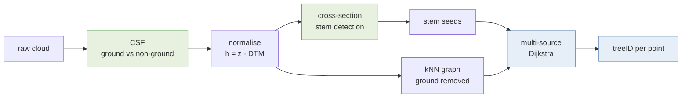

# NOVA course 2026 — point cloud tooling

My own take on the problems covered on **Day 3** (2026-08-19) of the NOVA PhD course
*Introduction to Point Cloud Processing for Forest Sciences*, written as
[marimo](https://marimo.io) notebooks and a small Python library.

> **This is student work, not course material.** I took the course as a participant.
> These are **not** the course instructions, and they deliberately do not follow them
> step for step — the demo runs interactively in CloudCompare and the Windows-only
> `PCT_demo.exe`, whereas this is an independent implementation in reproducible
> Python. Where I diverged from the taught approach, or measured something the course
> did not, that is my own choice and my own responsibility.
>
> Nothing here is endorsed by, or speaks for, the course organisers or NOVA. For the
> actual course content, go to the organisers.

It covers the same ground — CSF ground filtering, height normalisation, cross-section
stem detection, 3D Dijkstra region growing, stem taper reconstruction — and scores each
method against the reference labels that ship with the course data, which is the part I
was most interested in.

**No data is tracked here.** Point clouds (`*.laz`), slides and the `PCT_demo` bundle
are excluded by `.gitignore`. Re-fetch the course material from the organisers;
regenerate derived products with the scripts here.

## The course

**Introduction to Point Cloud Processing for Forest Sciences** — SLU course code
[P000158](https://www.slu.se/en/student-web/studies/courses-and-programmes/course-search/kurser/i/introduction-to-point-cloud-processing-for-forest-sciences/).

| | |
| --- | --- |
| Organised by | Swedish University of Agricultural Sciences (SLU), Department of Forest Resource Management |
| Location | Flämslätt and Remningstorp, Sweden, plus digital meetings |
| Level | Postgraduate / doctoral, third cycle (EQF level 8) |
| Credits | 3 ECTS (NOVA listing) · 4.5 Hp (SLU syllabus) |
| Term | 2026-05-18 to 2026-09-30 |
| Teaching | Blended, in person and online |
| Language | English |
| Course coordinator | Eva Lindberg |

The course covers processing of high-resolution point clouds from laser scanning and
digital photogrammetry: filtering and classification, surface normals and surface
models, conditional Euclidean clustering, and segmentation of tree crowns and stems by
both classical and AI methods, over 3D coordinates, 3D voxels and 2D pixels.

This repository touches only the Day 3 close-range-sensing material, and only the
parts I chose to reimplement.

## About NOVA

The **Nordic Forestry, Veterinary and Agricultural University Network (NOVA)** is a
university cooperation supporting the understanding of major global challenges in a
Nordic context. It provides PhD-level courses in agricultural, forestry and veterinary
sciences, and supports doctoral students, post-graduate veterinary specialisation
students and NOVA scientists in building international scientific networks.

Member universities:

| | |
| --- | --- |
| **SLU** | Sveriges lantbruksuniversitet — Swedish University of Agricultural Sciences, Sweden |
| **NMBU** | Norges miljø- og biovitenskapelige universitet — Norwegian University of Life Sciences, Norway |
| **LBHÍ** | Landbúnaðarháskóli Íslands — Agricultural University of Iceland, Iceland |
| **UEF** | Itä-Suomen Yliopisto, School of Forest Sciences — University of Eastern Finland |
| **UH-V** | Helsingin yliopisto, Eläinlääketieteellinen tiedekunta — University of Helsinki, Faculty of Veterinary Medicine, Finland |
| **UH-AF** | Helsingin yliopisto, Maatalous-metsätieteellinen tiedekunta — University of Helsinki, Faculty of Agriculture and Forestry, Finland |

More about NOVA: <https://www.lbhi.is/nova>

## Maintainer

**José M. Beltrán Abaunza, PhD** — [@jobelab](https://github.com/jobelab)
Sr. Research Engineer, Department of Earth and Environmental Sciences,
Lund University, Sweden

Participating in the course as a student; this repository is personal work done
alongside it, in no official capacity.

## Acknowledgements

This repository ports, wraps or builds on the work below. **None of these authors
contributed code here**, and any errors in this implementation are mine alone.

| work | authors | how it is used |
| --- | --- | --- |
| [**Point-Cloud-Tools (PCT)**](https://github.com/tuomasyr/Point-Cloud-Tools) | Dr. Tuomas Yrttimaa, University of Eastern Finland | `novatrees.chm_watershed` is a Python port of the crown-detection stage. CC BY 4.0. Cite [Yrttimaa 2021](https://doi.org/10.5281/zenodo.5779288), [Yrttimaa et al. 2019](https://doi.org/10.3390/rs11121423), [2020](https://doi.org/10.1016/j.isprsjprs.2020.08.017) |
| [**TreeAIBox / TreeisoNet**](https://github.com/NRCan/TreeAIBox) | Zhouxin Xi & Dani Degenhardt, Canadian Forest Service, Natural Resources Canada | driven directly for learned stem classification and tree location. [Xi & Degenhardt 2025](https://www.sciencedirect.com/science/article/pii/S266739322500002X) |
| [**3DFin**](https://github.com/3DFin/3DFin) and [**dendromatics**](https://github.com/3DFin/dendromatics) | the 3DFin developers | third-party forest inventory, and a better answer than ours for tilted stems |
| [**CSF**](https://github.com/jianboqi/CSF) | Wuming Zhang, Jianbo Qi et al. | ground filtering. [Zhang et al. 2016](https://doi.org/10.3390/rs8060501) |
| [**CloudCompare**](https://www.cloudcompare.org/) and [CloudCompare-PythonRuntime](https://github.com/tmontaigu/CloudCompare-PythonRuntime) | Daniel Girardeau-Montaut; Thomas Montaigu | the host application and its Python runtime |
| [**marimo**](https://marimo.io) | the marimo developers | the reactive notebook format |

The course and its Day 3 demo are the work of the organisers at SLU, with the
close-range-sensing session taught by Tuomas Yrttimaa. The approach implemented here
was learned from that session; the implementation, and any departures from it, are
mine.

## Licence

**GNU General Public License v3.0 or later** — see [`LICENSE`](LICENSE) for the full
text and [`NOTICE`](NOTICE) for attribution.

    NOVA course 2026 — point cloud tooling
    Copyright (C) 2026 José M. Beltrán Abaunza

    This program is free software: you can redistribute it and/or modify it under
    the terms of the GNU General Public License as published by the Free Software
    Foundation, either version 3 of the License, or (at your option) any later
    version.

### Why GPL over the CC BY it derives from

`src/novatrees/chm_watershed.py` ports part of Yrttimaa's Point-Cloud-Tools, which is
CC BY 4.0. CC BY explicitly permits distributing adapted material under the adapter's
own terms (§3(a)) so long as attribution is given and the original licence identified,
so a GPL-3.0 derivative is allowed. GPL is the better fit here because this is
software, and CC licences are not written for code — they say nothing about source
availability, linking, or patents.

Two things this does **not** do: it does not relicense Yrttimaa's original work, which
remains CC BY 4.0 at source; and it does not remove the attribution obligation, which
travels with any redistribution. Both are recorded in [`NOTICE`](NOTICE).

## Layout

    docs/           course demo reference, methods + equations, background notes
    setup/          how CloudCompare + its plugins were built and wired on this machine
    csf/            CSF ground/off-ground split from the shell
    src/novatrees/  the Python pipeline (xarray-based)
    notebooks/      marimo notebooks

## Quick start

    uv sync
    uv run marimo edit notebooks/00_ground_filtering_csf.py        # raw -> ground -> normalised
    uv run marimo edit notebooks/01_tree_instance_segmentation.py  # trees, two methods compared
    uv run marimo edit notebooks/02_methods_and_equations.py       # diagrams + the equations

Or from the shell:

    uv run nova-trees Day03_ToumasYrttima/crsot_mixed_stand_hnorm.laz \
        --reference "Day03_ToumasYrttima/tree seeds.laz"
    ./csf/run-csf.sh PCT_demo/PCT_demo/crsot_mixed_stand.laz DEMO

CloudCompare launches with `cloudcompare` (the wrapper in `setup/bin`, installed
to `~/.local/bin`). It carries the CSF, PCL and Python plugins.

## The pipeline

Green is semantic segmentation (*what kind of point is this?*), blue is instance
segmentation (*which tree is it?*). The semantic steps exist to serve the instance
step: ground classification makes the graph usable, stem detection supplies the seeds.

Point clouds are carried as `xarray.Dataset` objects over a `point` dimension, so
the per-point attributes a LAS file already has (`reflectance`, `treeid`, …) stay
named and aligned. The numeric kernels — scipy, scikit-learn, CSF — still take raw
arrays; xarray is the container, not the maths.

1. **Ground filtering** (`novatrees.csf`) — CSF via the authors' Python bindings,
   ~1 s on 15 M points. The CloudCompare plugin runs the same algorithm and is
   available for cross-checking.
2. **Height normalisation** — DTM per cell from the ground points. The per-cell
   statistic matters: the textbook minimum is biased low by sub-surface noise.
   Quantile 0.25 reproduces the course's own `_hnorm` to a bias of −0.002 m and
   RMSE 0.068 m; the minimum drifts to +0.264 m.
3. **Cross-section stem seeds** (`novatrees.pipeline`) — cluster a slice at breast
   height, fit circles, keep clusters that are stem-shaped *and* vertically
   continuous.
4. **3D Dijkstra region growing** — multi-source shortest path over a kNN graph of
   the above-ground points; each point takes the label of its geodesically nearest
   seed.

**Large merged instances are a seeding failure, not a growing failure.** The
biggest predicted tree on this plot swallows two reference trees almost entirely,
because only one of them had a seed. No graph parameter fixes that — `max_geodesic`
just truncates every tree, and `max_edge` barely moves it because the crowns really
do touch. Better seeds do fix it; see [`TREEAIBOX.md`](TREEAIBOX.md).

**The ground must come off before step 4.** The forest floor is one continuous
sheet of points touching the base of every stem, so with it in place the cheapest
path from one tree's seed to another tree's crown runs straight through the
ground, and labels bleed across the plot.

## State of the tooling, 2026-08-19

| Component | Status |
| --- | --- |
| CloudCompare | built from source, `v2.13.1-372-g0d385434`, installed to `/opt/cloudcompare-qt6-qpcl` |
| qCSF (Cloth Simulation Filter) | built and loading |
| qPCL / PCD I/O | loading, once `/opt/pcl-qt6/lib` is on the loader path |
| PythonRuntime (`pycc`) | built and loading, one local patch |
| TreeAIBox | installed, imports cleanly, **CPU-only** |
| 3DFin / dendromatics | installed; auto-registers as a CloudCompare Python plugin |

TreeAIBox runs but this machine has no NVIDIA GPU, while every bundled model
config is labelled for 3–12 GB of VRAM. Expect slow inference and test on a
small clip first.

The Day 3 demo instructions this pipeline reimplements are transcribed in
[`docs/course-demo-workflow.md`](docs/course-demo-workflow.md), with a phase-by-phase
comparison against what `novatrees` actually does.

Full detail, including the two version traps that cost the most time, is in
[`setup/cloudcompare-linux.md`](setup/cloudcompare-linux.md). Every formula the
pipeline computes — bias, RMSE, IoU, the CSF and Dijkstra definitions — is written
out with the measured numbers in
[`docs/methods-and-equations.md`](docs/methods-and-equations.md).

## Comparing against Yrttimaa's method

`novatrees.chm_watershed` ports the crown-detection stage of **Point-Cloud-Tools**
(PCT) — the MATLAB toolbox by Dr. Tuomas Yrttimaa behind `PCT_demo_installer.exe`
in the course material. It is top-down: CHM → gaussian smooth → local-maxima tree
tops → marker-controlled watershed.

Scored against the reference `treeid` labels in the cloud (41 instances):

| method | seeds | instances | matched of 41 | recall | precision | mean IoU | h RMSE | under-seg |
| --- | ---: | ---: | ---: | ---: | ---: | ---: | ---: | ---: |
| A  CHM watershed (PCT port) | 13 | 13 | 6 | 0.15 | 0.46 | 0.735 | 1.99 m | 7 |
| B  cross-section seeds | 38 | 32 | 24 | 0.59 | 0.75 | 0.790 | 0.87 m | 5 |
| **B+ pre-screened (verticality + reflectance)** | 37 | 36 | **28** | **0.68** | 0.78 | **0.805** | **0.82 m** | **3** |
| C  TreeAIBox learned seeds | 34 | 28 | 22 | 0.54 | **0.79** | 0.805 | 0.95 m | 5 |

Recall is against **all 41** reference trees (`recall_total`), not only those a
prediction happened to overlap — see `novatrees.evaluate` for why that distinction
matters.

Method C swaps our cross-section seeds for TreeAIBox's trained stem detector and keeps
the growing identical, so it isolates the seeding; see [`TREEAIBOX.md`](TREEAIBOX.md).
It costs under 3 minutes of CPU for the full plot and still gives the best precision.

**B+ is the best overall**, and that reverses an earlier reading of these results. C
beat B when B clustered the raw cross-section. Adding the course demo's verticality
and reflectance pre-screen lifted B past it — 28 matched trees against 22, and a lower
height RMSE. The learned detector did not get worse; the geometric route got better.

The gap is not a tuning failure, and no CHM parameters close it. **23 of the 41
trees are under 10 m** in a canopy reaching 22.8 m, median tree height 7.5 m — over
half this stand is suppressed. A canopy height model keeps only the highest return
per cell, so a tree beneath a taller neighbour leaves no trace in it. Cross-section
seeding looks at breast height, where a suppressed stem is as visible as a dominant
one.

Note what is being compared: PCT uses crown segments as a *partition* step and then
classifies stem points within each segment. This is one stage of that pipeline
against a complete alternative, not the whole toolbox.

## Reference results

CSF on `crsot_mixed_stand.laz` (TLS, 18.0 × 18.8 m, 15,595,864 points),
cloth 0.2 m, threshold 0.3 m, relief:

| implementation | ground | share |
| --- | ---: | ---: |
| CloudCompare `qCSF` | 3,830,441 | 24.6 % |
| Python `cloth-simulation-filter` | 3,659,893 | 23.5 % |

Ground spans only ~1.03 m across the plot. Tree instance segmentation from our own
CSF normalisation finds **40–41 stems**, against 41 reference instances.
