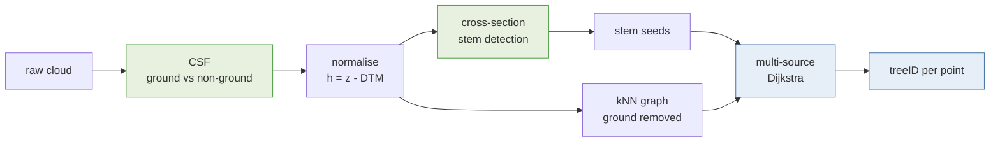

# NOVA course 2026 — point cloud tooling

Working notes and tooling for the NOVA 2026 course, on WSL2 / Ubuntu 24.04.

**No data is tracked here.** Point clouds (`*.laz`), course slides and the
`PCT_demo` bundle are deliberately excluded by `.gitignore` — see the global
convention of keeping git to source, docs and configuration. Re-fetch the course
material from the organisers; regenerate derived products with the scripts here.

## Layout

    docs/           course demo reference, methods + equations, background notes
    setup/          how CloudCompare + its plugins were built and wired on this machine
    csf/            CSF ground/off-ground split from the shell
    src/novatrees/  the Python pipeline (xarray-based)
    notebooks/      marimo notebooks

## Quick start

    uv sync
    uv run marimo edit notebooks/00_ground_filtering_csf.py        # raw -> ground -> normalised
    uv run marimo edit notebooks/01_tree_instance_segmentation.py  # trees, two methods compared
    uv run marimo edit notebooks/02_methods_and_equations.py       # diagrams + the equations

Or from the shell:

    uv run nova-trees Day03_ToumasYrttima/crsot_mixed_stand_hnorm.laz \
        --reference "Day03_ToumasYrttima/tree seeds.laz"
    ./csf/run-csf.sh PCT_demo/PCT_demo/crsot_mixed_stand.laz DEMO

CloudCompare launches with `cloudcompare` (the wrapper in `setup/bin`, installed
to `~/.local/bin`). It carries the CSF, PCL and Python plugins.

## The pipeline

Green is semantic segmentation (*what kind of point is this?*), blue is instance
segmentation (*which tree is it?*). The semantic steps exist to serve the instance
step: ground classification makes the graph usable, stem detection supplies the seeds.

Point clouds are carried as `xarray.Dataset` objects over a `point` dimension, so
the per-point attributes a LAS file already has (`reflectance`, `treeid`, …) stay
named and aligned. The numeric kernels — scipy, scikit-learn, CSF — still take raw
arrays; xarray is the container, not the maths.

1. **Ground filtering** (`novatrees.csf`) — CSF via the authors' Python bindings,
   ~1 s on 15 M points. The CloudCompare plugin runs the same algorithm and is
   available for cross-checking.
2. **Height normalisation** — DTM per cell from the ground points. The per-cell
   statistic matters: the textbook minimum is biased low by sub-surface noise.
   Quantile 0.25 reproduces the course's own `_hnorm` to a bias of −0.002 m and
   RMSE 0.068 m; the minimum drifts to +0.264 m.
3. **Cross-section stem seeds** (`novatrees.pipeline`) — cluster a slice at breast
   height, fit circles, keep clusters that are stem-shaped *and* vertically
   continuous.
4. **3D Dijkstra region growing** — multi-source shortest path over a kNN graph of
   the above-ground points; each point takes the label of its geodesically nearest
   seed.

**Large merged instances are a seeding failure, not a growing failure.** The
biggest predicted tree on this plot swallows two reference trees almost entirely,
because only one of them had a seed. No graph parameter fixes that — `max_geodesic`
just truncates every tree, and `max_edge` barely moves it because the crowns really
do touch. Better seeds do fix it; see [`TREEAIBOX.md`](TREEAIBOX.md).

**The ground must come off before step 4.** The forest floor is one continuous
sheet of points touching the base of every stem, so with it in place the cheapest
path from one tree's seed to another tree's crown runs straight through the
ground, and labels bleed across the plot.

## State of the tooling, 2026-08-19

| Component | Status |
| --- | --- |
| CloudCompare | built from source, `v2.13.1-372-g0d385434`, installed to `/opt/cloudcompare-qt6-qpcl` |
| qCSF (Cloth Simulation Filter) | built and loading |
| qPCL / PCD I/O | loading, once `/opt/pcl-qt6/lib` is on the loader path |
| PythonRuntime (`pycc`) | built and loading, one local patch |
| TreeAIBox | installed, imports cleanly, **CPU-only** |
| 3DFin / dendromatics | installed; auto-registers as a CloudCompare Python plugin |

TreeAIBox runs but this machine has no NVIDIA GPU, while every bundled model
config is labelled for 3–12 GB of VRAM. Expect slow inference and test on a
small clip first.

The Day 3 demo instructions this pipeline reimplements are transcribed in
[`docs/course-demo-workflow.md`](docs/course-demo-workflow.md), with a phase-by-phase
comparison against what `novatrees` actually does.

Full detail, including the two version traps that cost the most time, is in
[`setup/cloudcompare-linux.md`](setup/cloudcompare-linux.md). Every formula the
pipeline computes — bias, RMSE, IoU, the CSF and Dijkstra definitions — is written
out with the measured numbers in
[`docs/methods-and-equations.md`](docs/methods-and-equations.md).

## Comparing against Yrttimaa's method

`novatrees.chm_watershed` ports the crown-detection stage of **Point-Cloud-Tools**
(PCT) — the MATLAB toolbox by Dr. Tuomas Yrttimaa behind `PCT_demo_installer.exe`
in the course material. It is top-down: CHM → gaussian smooth → local-maxima tree
tops → marker-controlled watershed.

Scored against the reference `treeid` labels in the cloud (41 instances):

| method | trees | matched | recall | precision | mean IoU | h RMSE |
| --- | ---: | ---: | ---: | ---: | ---: | ---: |
| A  CHM watershed (PCT port) | 13 | 6 | 0.15 | 0.46 | 0.735 | 1.99 m |
| B  cross-section + Dijkstra | 30 | 20 | 0.51 | 0.67 | 0.778 | 0.97 m |
| C  TreeAIBox seeds + Dijkstra | 28 | 21 | **0.54** | **0.75** | **0.808** | **0.95 m** |

Method C swaps our cross-section seeds for TreeAIBox's trained stem detector and keeps
the growing identical, so it isolates the seeding. It wins on every measure; see
[`TREEAIBOX.md`](TREEAIBOX.md). It costs under 3 minutes of CPU for the full plot.

The gap is not a tuning failure, and no CHM parameters close it. **23 of the 41
trees are under 10 m** in a canopy reaching 22.8 m, median tree height 7.5 m — over
half this stand is suppressed. A canopy height model keeps only the highest return
per cell, so a tree beneath a taller neighbour leaves no trace in it. Cross-section
seeding looks at breast height, where a suppressed stem is as visible as a dominant
one.

Note what is being compared: PCT uses crown segments as a *partition* step and then
classifies stem points within each segment. This is one stage of that pipeline
against a complete alternative, not the whole toolbox.

## Reference results

CSF on `crsot_mixed_stand.laz` (TLS, 18.0 × 18.8 m, 15,595,864 points),
cloth 0.2 m, threshold 0.3 m, relief:

| implementation | ground | share |
| --- | ---: | ---: |
| CloudCompare `qCSF` | 3,830,441 | 24.6 % |
| Python `cloth-simulation-filter` | 3,659,893 | 23.5 % |

Ground spans only ~1.03 m across the plot. Tree instance segmentation from our own
CSF normalisation finds **40–41 stems**, against 41 reference instances.
