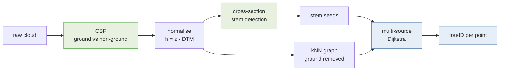

# Methods and equations

Every formula the pipeline computes, in one place, with the measured numbers from
`crsot_mixed_stand.laz` beside them. The same content is interactive in
`notebooks/02_methods_and_equations.py`; this is the version you can read without
starting a kernel.

## Semantic vs instance segmentation

Two different questions, and the pipeline answers both.

**Semantic** - *what kind of point is this?* A label from a fixed vocabulary:

$$f_{\text{sem}} : \mathbb{R}^3 \rightarrow \mathcal{C}, \qquad
  \mathcal{C} = \{\text{ground},\ \text{stem},\ \text{foliage}\}$$

**Instance** - *which tree is this point part of?* An identifier with no fixed
vocabulary, because the number of trees is discovered rather than known:

$$f_{\text{inst}} : \mathbb{R}^3 \rightarrow \{1, \dots, K\} \cup \{\varnothing\},
  \qquad K \text{ unknown a priori}$$

Both together is *panoptic* segmentation. The semantic steps here exist to serve
the instance step: ground classification makes the graph usable, stem detection
supplies the seeds.

---

## 1. Bias and RMSE

The two numbers used to judge height normalisation, over $n$ points with estimate
$\hat{h}_i$ and reference $h_i$:

$$\mathrm{bias} = \frac{1}{n} \sum_{i=1}^{n} \left( \hat{h}_{i} - h_{i} \right)$$

$$\mathrm{RMSE} = \sqrt{ \frac{1}{n} \sum_{i=1}^{n}
  \left( \hat{h}_{i} - h_{i} \right)^{2} }$$

They are not independent. With $s$ the standard deviation of the residuals,

$$\mathrm{RMSE}^{2} = \mathrm{bias}^{2} + s^{2}$$

**Read them together.** A method can be unbiased and noisy, or have a small RMSE
that is almost entirely systematic offset. The second case is what happened here.

### Measured: DTM statistic vs the course's own `_hnorm`

Identical point order in both files, so this is a true point-to-point comparison.

| per-cell statistic | bias | RMSE | $s$ | within 0.25 m |
| --- | ---: | ---: | ---: | ---: |
| minimum ($q = 0$, textbook) | +0.264 m | 0.275 m | 0.077 m | 28.4 % |
| quantile 0.10 | +0.054 m | 0.097 m | - | 99.0 % |
| **quantile 0.25** (default) | **−0.002 m** | **0.068 m** | - | **98.8 %** |
| quantile 0.02 | +0.150 m | 0.177 m | - | 82.0 % |

For the minimum, $s = \sqrt{0.275^2 - 0.264^2} \approx 0.077$ m - so 96 % of the
mean-square error is bias. That is a systematic problem with a fix, not noise to
be tolerated, and the fix is the quantile.

---

## 2. CSF - cloth simulation

Invert the cloud and drop a cloth on it. Each cloth particle is a mass under
gravity, integrated with Verlet:

$$\mathbf{X}(t + \Delta t) = 2\,\mathbf{X}(t) - \mathbf{X}(t - \Delta t)
  + \frac{\mathbf{G}}{m}\,\Delta t^{2}$$

Internal constraints then pull connected particles $i, j$ back together:

$$\Delta \mathbf{p} = \tfrac{1}{2}\, b \,(\mathbf{p}_{j} - \mathbf{p}_{i}),
  \qquad b \in \{0, 1\}$$

with $b = 0$ for particles already pinned by terrain. **Rigidness** is how many
times this is applied per step - more iterations, a stiffer cloth that ignores
small dips. Classification is a single distance test against the settled cloth:

$$c(\mathbf{p}) =
  \begin{cases}
    \text{ground}, & \lvert z_{\mathbf{p}} - z_{\text{cloth}}(\mathbf{p}) \rvert \le h_{cc} \\
    \text{non-ground}, & \text{otherwise}
  \end{cases}$$

where $h_{cc}$ is `class_threshold`.

**Measured:** cloth 0.2 m, threshold 0.3 m, relief. Python `cloth-simulation-filter`
3,659,893 ground points (23.5 %); CloudCompare `qCSF` 3,830,441 (24.6 %). The
plugin's scene presets bundle post-processing the raw library omits.

---

## 3. Height normalisation

$$\mathrm{DTM}(i,j) = Q_{q}\big(\{\, z_{p} \;:\; p \in \mathcal{G},\;
  \kappa(p) = (i,j) \,\}\big), \qquad
  h_{p} = z_{p} - \mathrm{DTM}\big(\kappa(p)\big)$$

$\mathcal{G}$ is the ground set, $\kappa(p)$ the cell of point $p$, $Q_q$ the
$q$-quantile. $q = 0$ recovers the minimum; empty cells are filled from the
nearest filled cell. See the table in §1 for why $q$ matters.

---

## 4. Cross-section stem detection

**DBSCAN** on the 2D slice. A point is core when its $\varepsilon$-ball holds at
least `minPts` neighbours:

$$N_{\varepsilon}(p) = \{\, q \in D \;:\; \lVert p - q \rVert_{2} \le \varepsilon \,\},
  \qquad p \text{ core} \iff \lvert N_{\varepsilon}(p) \rvert \ge \mathrm{minPts}$$

Clusters are the transitive closure of core points. No cluster count is needed in
advance, which is the property the problem requires.

**Taubin circle fit.** A circle in algebraic form is

$$A\,(x^{2} + y^{2}) + B\,x + C\,y + D = 0$$

and Taubin minimises the algebraic distance normalised by its gradient, which is
what makes it unbiased on partial arcs - the usual case in TLS, where a stem is
scanned from one side:

$$\min_{A,B,C,D} \;
  \frac{\sum_{i} \left( A(x_{i}^{2} + y_{i}^{2}) + B x_{i} + C y_{i} + D \right)^{2}}
       {4A^{2}\,\overline{(x^{2} + y^{2})} + 4AB\,\bar{x} + 4AC\,\bar{y} + B^{2} + C^{2}}$$

$$(x_{c}, y_{c}) = \left( \frac{-B}{2A},\ \frac{-C}{2A} \right), \qquad
  r = \frac{\sqrt{B^{2} + C^{2} - 4AD}}{2\lvert A \rvert}, \qquad
  \mathrm{DBH} = 2r$$

**Vertical continuity.** A stem persists above and below breast height; a bush
does not. A candidate survives only if both check slabs hold enough points within
the fitted radius:

$$\Big\lvert \{\, p \in S^{-} : \lVert (x_p, y_p) - (x_c, y_c) \rVert \le r + \delta \,\} \Big\rvert \ge m
  \quad \wedge \quad \text{same for } S^{+}$$

This single test is what rejects understory clutter.

**Measured, without the pre-screen:** 38 stems, median DBH 0.315 m, 29 of 36 reference
seed positions hit, median offset 0.09 m.

**Measured, with the verticality and reflectance pre-screen** (see section 9): 37
stems, **33 of 36** hit, median offset **0.03 m**. Same slice, same clustering; the
difference is which points reach the clustering step.

---

## 5. 3D Dijkstra region growing

Voxel-downsample the above-ground points to graph nodes:

$$\kappa(\mathbf{p}) = \left\lfloor \mathbf{p} / v \right\rfloor$$

Build an undirected kNN graph $G = (V, E)$, refusing edges longer than $d_{\max}$:

$$w(u,v) =
  \begin{cases}
    \lVert \mathbf{p}_{u} - \mathbf{p}_{v} \rVert_{2},
      & v \in \mathrm{kNN}_{k}(u) \ \wedge\ \lVert \mathbf{p}_{u} - \mathbf{p}_{v} \rVert_{2} \le d_{\max} \\
    \infty, & \text{otherwise}
  \end{cases}$$

Geodesic distance from seed $s$ to node $x$ is the cheapest path *through the
cloud*:

$$d_{g}(s, x) = \min_{\pi \in \Pi(s,x)} \sum_{(a,b) \in \pi} w(a,b)$$

and each node takes its nearest seed:

$$\ell(x) = \arg\min_{s \in S} \; d_{g}(s, x)$$

This is a **geodesic Voronoi partition**. The contrast with ordinary Voronoi is
the point: straight-line distance would hand a low branch to whichever stem is
nearest in space even across a gap, while geodesic distance must travel through
the tree, so a branch stays with the trunk it is attached to.

Computed for all seeds in one multi-source pass, $O(\lvert E \rvert \log \lvert V \rvert)$.

**Measured:** 353,301 nodes, 2.8 M edges at `max_edge` 0.50, 98.9 % of nodes reached,
8 s. The default is now 0.25, which trades a few edges for better matching.

---

## 6. Scoring instance segmentation

Instances are sets of points, so overlap is intersection over union:

$$\mathrm{IoU}(P_{i}, R_{j}) = \frac{\lvert P_{i} \cap R_{j} \rvert}{\lvert P_{i} \cup R_{j} \rvert}
  = \frac{\lvert P_{i} \cap R_{j} \rvert}{\lvert P_{i} \rvert + \lvert R_{j} \rvert - \lvert P_{i} \cap R_{j} \rvert}$$

Predictions are matched to references greedily, highest IoU first, one-to-one; a
match counts above threshold $\tau = 0.5$:

$$\mathrm{precision} = \frac{\mathrm{TP}}{\lvert \hat{\mathcal{T}} \rvert}, \qquad
  \mathrm{recall} = \frac{\mathrm{TP}}{\lvert \mathcal{T} \rvert}, \qquad
  F_{1} = \frac{2\,\mathrm{PR}}{\mathrm{P} + \mathrm{R}}$$

Those hide the two failure modes that matter most in forestry, so with coverage
fraction $\phi = 0.20$ they are counted separately. **Over-segmentation** - one
reference tree split across several predictions:

$$\mathrm{split}(R_{j}) = \Big\lvert \Big\{ i \;:\;
  \tfrac{\lvert P_{i} \cap R_{j} \rvert}{\lvert R_{j} \rvert} \ge \phi \Big\} \Big\rvert > 1$$

**Under-segmentation** - one prediction swallowing several reference trees:

$$\mathrm{merge}(P_{i}) = \Big\lvert \Big\{ j \;:\;
  \tfrac{\lvert P_{i} \cap R_{j} \rvert}{\lvert P_{i} \rvert} \ge \phi \Big\} \Big\rvert > 1$$

---

## 7. Tree-level attribute errors

Segmentation produces no height field to difference, so the comparable quantities
are per-tree, over matched instances only. An undetected tree has a detection
failure, not a height error, and averaging the two together hides both:

$$\mathrm{bias}_{h} = \frac{1}{M}\sum_{k=1}^{M}\left(\hat{H}_{k} - H_{k}\right),
  \qquad
  \mathrm{RMSE}_{h} = \sqrt{\frac{1}{M}\sum_{k=1}^{M}\left(\hat{H}_{k} - H_{k}\right)^{2}}$$

with $H_k = \max\{h_p : p \in R_k\}$ and $M$ the number of matched pairs. Position
error uses the base points, where a stem actually is:

$$\mathrm{RMSE}_{xy} = \sqrt{\frac{1}{M}\sum_{k=1}^{M}
  \big\lVert \bar{\mathbf{c}}(\hat{P}_{k}) - \bar{\mathbf{c}}(R_{k}) \big\rVert_{2}^{2}}$$

### Measured: three methods, 41 reference trees

| method | trees | matched | recall | precision | mean IoU | $\mathrm{bias}_h$ | $\mathrm{RMSE}_h$ | $\mathrm{RMSE}_{xy}$ |
| --- | ---: | ---: | ---: | ---: | ---: | ---: | ---: | ---: |
| A CHM watershed (PCT) | 13 | 6 | 0.15 | 0.46 | 0.735 | +1.125 m | 1.987 m | 0.537 m |
| B cross-section + Dijkstra | 30 | 20 | 0.51 | 0.67 | 0.778 | −0.492 m | 0.973 m | 0.249 m |
| C TreeAIBox seeds + Dijkstra | 28 | 21 | **0.54** | **0.75** | **0.808** | **−0.481 m** | **0.948 m** | **0.222 m** |

A's **positive** height bias is its failure mode as a number: absorbing a
suppressed tree into a dominant neighbour makes the reported instance taller than
the reference tree it matched. B and C are slightly negative - clipping crown
tips rather than over-claiming.

---

## 8. The reference method: CHM watershed

$$\mathrm{CHM}(i,j) = \max \{\, h_{p} \;:\; \kappa(p) = (i,j) \,\}, \qquad
  \tilde{C} = \mathrm{CHM} * G_{\sigma}$$

$$T = \{\, (i,j) \;:\; \tilde{C}(i,j) = \max_{\lVert (i,j)-(u,v) \rVert \le \rho} \tilde{C}(u,v)
  \ \wedge\ \tilde{C}(i,j) \ge h_{\min} \,\}$$

then watershed basins flood the inverted surface $-\tilde{C}$ from those markers.

**Where it breaks here.** The $\max$ in the first equation is the whole problem. A
suppressed tree beneath a taller neighbour contributes to no cell's maximum, so it
is absent from $\tilde{C}$, absent from $T$, and unrecoverable downstream. On this
plot **23 of 41 reference trees are under 10 m** in a 22.8 m canopy, median tree
height 7.5 m. Over half the stand is invisible before a parameter is chosen.

---

## 9. Added after the first pass

These were not in the original write-up. Each earned its place by measurement, and
the measurement is given so the claim can be checked.

### Noise filtering

Statistical outlier removal compares each point's mean distance to its $k$ nearest
neighbours against the cloud-wide distribution:

$$\bar{d}_i = \frac{1}{k}\sum_{j \in \mathrm{kNN}(i)} \lVert \mathbf{p}_i - \mathbf{p}_j \rVert,
\qquad \text{reject if } \bar{d}_i > \mu_{\bar d} + n_\sigma\, \sigma_{\bar d}$$

Four things get called noise and only three are reachable this way. Isolated returns
go easily. **Mixed pixels** form a halo just outside the bark, where a beam clipping
a stem edge returns a distance averaged with whatever lies behind, and a circle
fitted through the halo reports DBH too large. **Mist** is diffuse rather than
isolated, so the k-nearest test finds each droplet well-connected and keeps it; a
radius filter or the reflectance screen works instead. **Registration ghosts** need
better registration, not filtering.

### Weighted stem score

Each feature is scaled to 0-1 on its 1st to 99th percentiles, then weighted:

$$S(\mathbf{p}) = \frac{w_v\,\tilde{v} + w_r\,(1 - \tilde{\rho}) + w_d\,(1 - \tilde{r})}{w_v + w_r + w_d}$$

for verticality $\tilde v = 1 - \lvert n_z \rvert$, transformed reflectance
$\tilde\rho$ (low means bark) and radial distance $\tilde r$ to the nearest stem
axis. The pre-screen keeps the top $p$ per cent by $S$.

**Measured on the full plot:** recall 0.63 to 0.77 and precision 0.67 to 0.87
against reference seed positions. Reflectance carries most of it, separating bark
from foliage by about 9 dB.

### Stem taper and volume

Circles are fitted per slice by RANSAC, filtered against the last accepted slice,
then smoothed or fitted with an analytic form. Volume follows by integration:

$$V = \int_{z_0}^{z_1} \pi \left( \frac{d(z)}{2} \right)^{2} dz$$

The Kozak form keeps a power of $X$ whose exponent varies with relative height:

$$d(h) = D \cdot X^{\,b_1 z^2 + b_2 \ln(z + 0.001) + b_3 \sqrt{z} + b_4 e^{z}},
\qquad X = \frac{1 - \sqrt{z}}{1 - \sqrt{p}}, \quad z = h/H, \quad p = 1.3/H$$

reduced to four coefficients, because the published nine-coefficient version is
fitted across a population rather than one stem.

### Sector occupancy, and what the ellipse cannot do

Occupancy is the fraction of the circumference with points behind it. A circle
fitted to a narrow arc is a guess; the same fit on a wide arc is a measurement.
Median coverage on the Day 3 plot is 91 per cent.

A cylinder leaning $\theta$ cuts a horizontal plane in an ellipse of axis ratio
$\cos\theta$, so lean looks recoverable from the cross-section. **It is not, at
these angles.** Median lean here is 4.4 degrees, predicting an axis ratio of 0.997,
while stems are 5 to 15 per cent out of round from ovality and bark alone. The
signal sits roughly 50 times under the noise, and correlation with PCA-derived lean
came out at 0.25 with a properly constrained fit. Axis ratio ships as a quality
flag; lean comes from the tracked centreline.

### Fork detection

A chain of components counts as a second stem only if it persists, runs vertically,
and holds its thickness:

$$n \ge n_{\min} \quad\wedge\quad \Delta z \ge 2\,\mathrm{m} \quad\wedge\quad
\arctan\!\left(\frac{\lVert \Delta xy \rVert}{\Delta z}\right) \le 25^\circ
\quad\wedge\quad r \ge 0.35\, r_{\text{main}}$$

All four are needed. Counting components alone marked 32 of 32 trees as forked;
adding persistence alone still marked 12 of 12. With all four it is 3 of 12.

### Instance recall, and a denominator that misleads

$$\mathrm{recall} = \frac{\mathrm{TP}}{\lvert \mathcal{T}_{\text{overlapped}} \rvert}
\qquad\text{versus}\qquad
\mathrm{recall}_{\text{total}} = \frac{\mathrm{TP}}{\lvert \mathcal{T}_{\text{all}} \rvert}$$

The first counts only reference trees some prediction touched, so **covering less of
the plot raises it**. One perfectly segmented tree and nothing else scores 1.00 on
the first and 0.02 on the second. Use `recall_total` whenever the methods being
compared cover different amounts of ground.

---

## Sources

- CSF - Zhang W. et al. (2016), [Remote Sensing 8(6):501](https://doi.org/10.3390/rs8060501)
- Taubin fit - Taubin G. (1991), *IEEE PAMI* 13(11)
- DBSCAN - Ester M. et al. (1996), *KDD-96*
- PCT - Yrttimaa T. (2021), [zenodo.5779288](https://doi.org/10.5281/zenodo.5779288);
  [Yrttimaa et al. 2019](https://doi.org/10.3390/rs11121423),
  [2020](https://doi.org/10.1016/j.isprsjprs.2020.08.017)
- TreeAIBox - [NRCan/TreeAIBox](https://github.com/NRCan/TreeAIBox)
