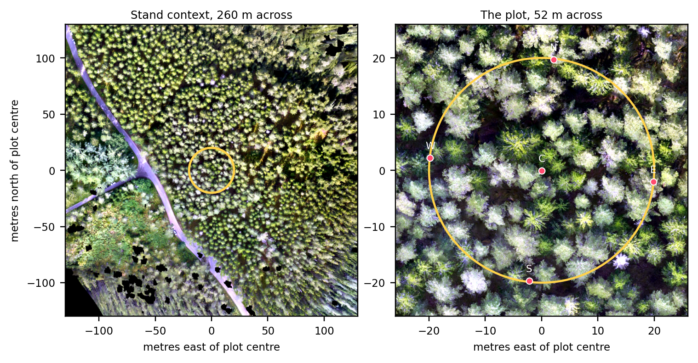
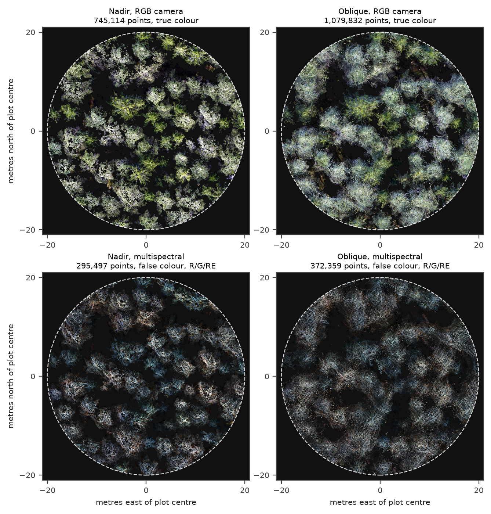
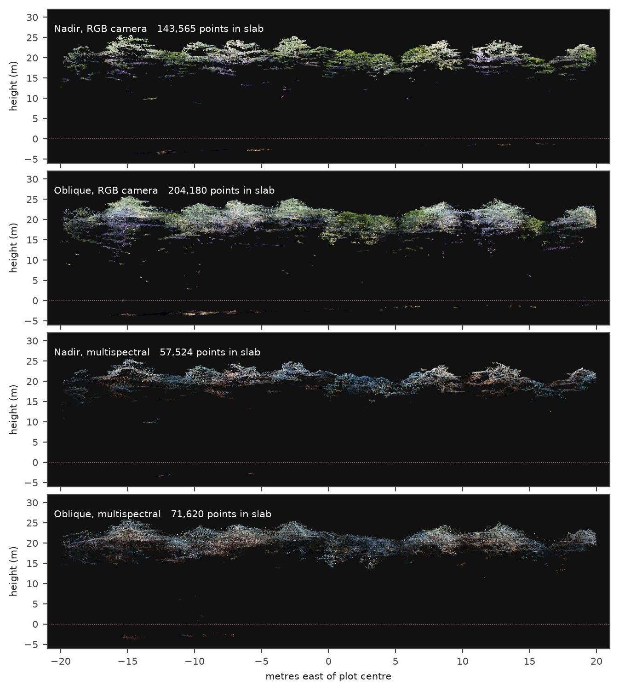
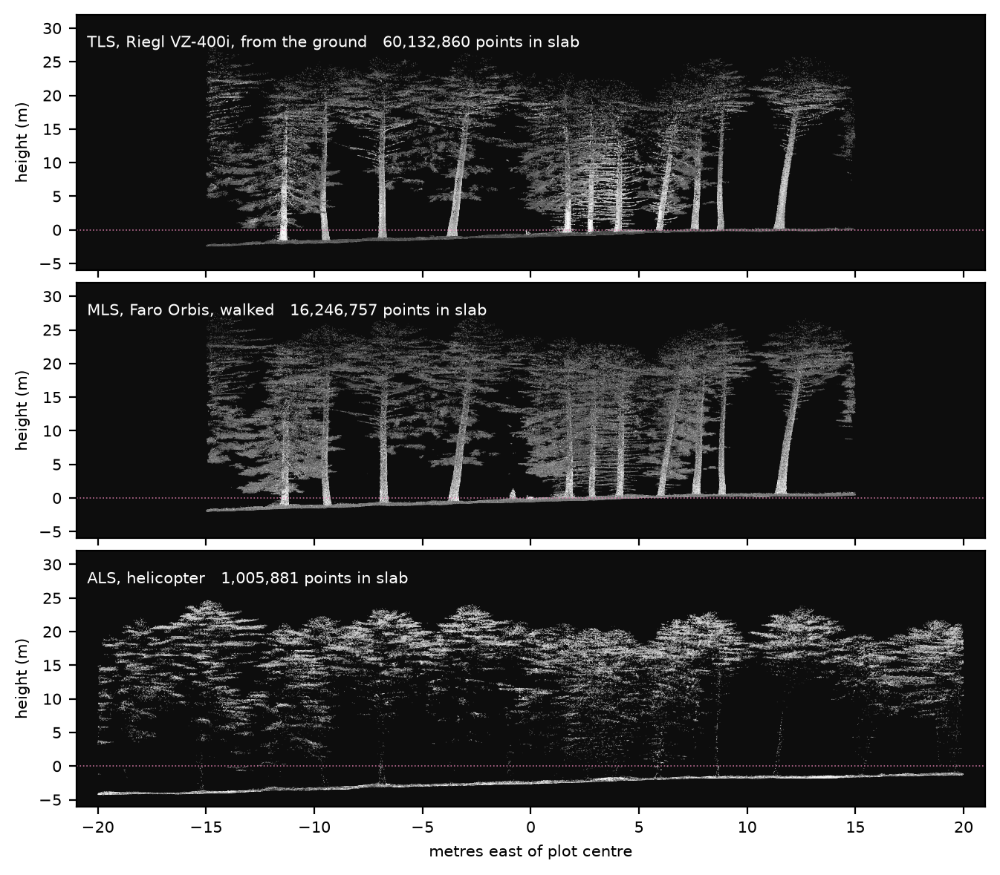
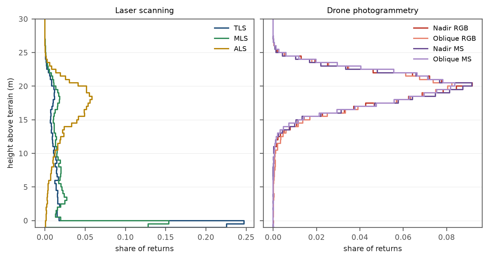
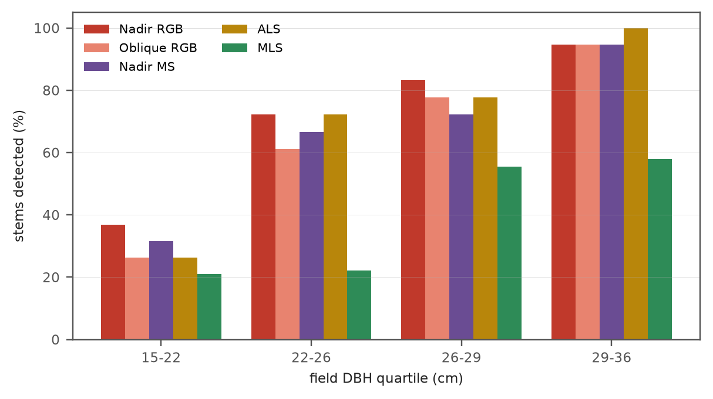
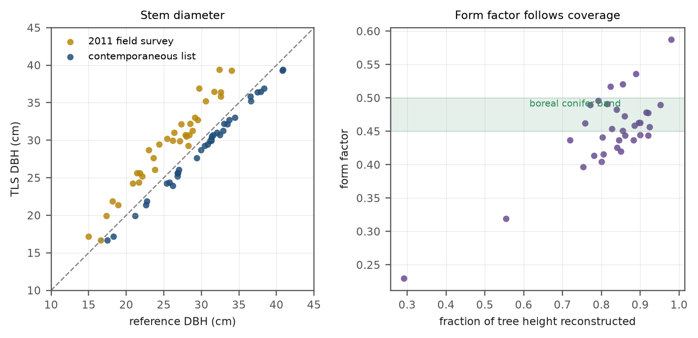
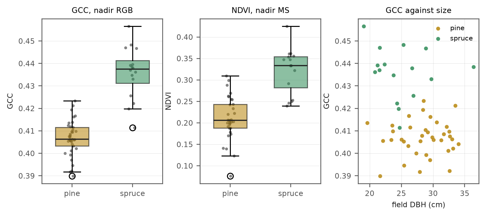

% What a drone point cloud can measure on a forest plot
% José M. Beltrán-Abaunza (jose.beltran@mgeo.lu.se), Lund University
% NOVA 2026 individual project: point cloud processing for forestry

# Summary

I compared seven point clouds of one 20 m forest plot at Remningstorp: four from a drone
(nadir and oblique flights, each with an RGB and a multispectral camera) and three from
laser scanners (terrestrial, mobile and helicopter). Seventy-four stems on the plot have
been surveyed in the field.

Following the course teachers' advice, this report covers the two point cloud questions
of my proposal. RQ4 asks how flight geometry changes the reconstructed canopy. RQ5 asks
what a drone cloud can measure compared with laser scanning and the field data. The three
spectral questions (RQ1 to RQ3) are summarised in Appendix A, and Appendix B is a
glossary of the terms and acronyms used.

My main results:

- Flight geometry changes the crowns but not the heights. Oblique flights give 26 to 45 %
  more points, crowns about a third larger, and fewer detected trees. Canopy height
  changes by only 0.1 to 0.2 m.
- The drone sees only the top of the canopy. It matches the helicopter lidar on canopy
  height (p95 23.6 to 23.8 m against 23.77 m) and on tree detection (F1 0.815 against
  0.794 over the whole plot), but it sees no ground and no stems. Where all instruments
  have data, detecting stems directly in the TLS and MLS clouds works best (F1 0.800).
- Stem diameter can only be measured from below, to 1.3 cm RMSE with TLS.
- The largest error I found was a 2.089 m vertical offset between the helicopter lidar
  and the mobile scanner. It would have made every drone tree height 2.089 m too tall, and
  nothing in the drone data could have shown it.

# 1. Introduction

## 1.1 Background

Forest point clouds are made in two ways: by laser scanning, which measures the range to
each target, and by digital photogrammetry, which reconstructs 3D points by matching
overlapping images (Lindberg, 2026; Bohlin, 2026). Airborne laser scanning (ALS) has been
used operationally in forest inventory since 2002, when the area-based approach was
introduced in Norway (SLU, 2016). Image-matching point clouds give canopy heights in the
same way as laser data, but less information about forest density, so estimates of timber
volume are worse (SLU, 2016). A drone makes such a photogrammetric cloud cheap to collect
over a single stand.

Ground-based scanners see the forest from below. Terrestrial laser scanning (TLS) is
precise but suffers from occlusion, and mobile laser scanning (MLS) is faster but less
accurate (Liang et al., 2016; Holvoet et al., 2025; Yrttimaa, 2026a). Stems can be found in
these clouds by fitting circles to thin horizontal slices and following them upward
(Olofsson et al., 2014; Yrttimaa, 2026b). The platforms trade coverage for resolution: ALS
covers large areas at lower resolution, and ground-based scanning small areas at high
resolution (de Paula Pires, 2026a). A canopy height model only sees the top surface, so
trees below the canopy are hidden from methods that use it (de Paula Pires, 2026b). As a
benchmark, Liang et al. (2016) give typical field inventory requirements of 0 to 2 cm for
DBH and 0.5 m for tree height.

Remningstorp, in Västergötland, is owned by Hildur & Sven Wingquists stiftelse för
skogsvetenskaplig forskning, a foundation set up in 1946 to keep the estate as a forest
laboratory, and is managed by Skogssällskapet (Skogssällskapet, n.d.). SLU has used it as
a long-term test site, where single-tree detection, TLS stem measurement and MLS tree
detection have been studied before (Vauhkonen et al., 2012; Olofsson et al.,
2014; de Paula Pires et al., 2022). Plot 167 was recorded with all of the instruments
above: four drone flights, TLS, MLS, helicopter ALS and a field survey. This makes it
possible to compare, on the same trees, what each instrument can measure.

## 1.2 Aim and objectives

My aim is to find out what a drone photogrammetric point cloud can measure on a forest
plot, and how this depends on the flight, by comparing it with laser scanning and field
data on the same trees. Following the course teachers' advice, I focus on the two point
cloud questions of my proposal (the spectral questions RQ1 to RQ3 are summarised in
Appendix A):

1. **RQ4.** How does flight geometry (nadir against oblique) change the reconstructed
   canopy surface, and do tree height, crown area and tree detection follow?
2. **RQ5.** What can a drone cloud measure compared with ALS, TLS, MLS and the field tree
   list, in terms of ground, canopy height, tree detection, stem diameter and volume?

# 2. Materials and methods

## 2.1 Study site and data

The study plot is plot 167 at Remningstorp, Västergötland, Sweden, centred at
E 420407.631, N 6481815.136 (SWEREF99 TM), with a ground elevation of 137.642 m (RH2000).

| cloud | instrument | points (whole delivery) |
|---|---|---:|
| `Nadir_RGB` | DJI Mavic 3 Multispectral, RGB camera | 46,347,917 |
| `Oblique_RGB` | same, RGB camera | 170,060,798 |
| `Nadir_MS` | same, multispectral camera | 15,641,772 |
| `Oblique_MS` | same, multispectral camera | 49,615,363 |
| TLS | Riegl VZ-400i | 290,336,075 |
| MLS | Faro Orbis | 61,020,343 |
| ALS | helicopter, Riegl MiniVUX-1DL + VUX-1HA + VQ-840-G | 11,205,212 |

The drone clouds were produced in Agisoft Metashape. The flight dates are not in the data.
I assume the nadir and oblique flights were flown on the same day or at most one day
apart, so the trees and the season are the same in both. TLS and MLS were delivered as a 30 by 30 m
box, which covers only 72 % of the plot, so 24 of the 74 field stems have no ground-based
data. I score those two scanners only inside their box.

The field reference is 74 stems surveyed in 2011 (45 Scots pine and 29 Norway spruce, DBH
15.0 to 36.4 cm, mean spacing 4.12 m).

## 2.2 Methods

I did all processing in Python with my own library (`novatrees`). Every number in this
report comes from the scripts in the repository.

- **Clipping.** I clipped every cloud to the 20 m plot polygon that the field list is
  defined on.
- **Terrain.** The drone clouds contain no ground, so I built the DTM from the ALS ground
  returns and checked it against MLS ground points.
- **Tree detection.** I found treetops with a marker-controlled watershed on a canopy
  height model and matched them one to one with the field stems within 2.0 m. For TLS and
  MLS I also detected stems directly from a breast-height slice.
- **Stems.** Following Olofsson et al. (2014), I fitted circles to the breast-height slices with RANSAC and kept only stems
  with enough arc coverage and vertical continuity. I then followed each stem upward to
  get its taper and volume.

# 3. Results

## 3.1 The drone sees only the top of the canopy (RQ4, RQ5)

| cloud | median height (m) | p95 (m) | below 0.5 m |
|---|---:|---:|---:|
| `Nadir_RGB` | 20.07 | 23.76 | 4.8 % |
| `Oblique_RGB` | 19.87 | 23.68 | 6.1 % |
| `Nadir_MS` | 20.15 | 23.61 | 1.1 % |
| `Oblique_MS` | 20.24 | 23.83 | 2.4 % |
| TLS | 1.29 | 20.08 | 47.3 % |
| MLS | 5.94 | 20.85 | 28.3 % |
| ALS | 17.50 | 23.77 | 25.8 % |

The drone clouds put their median at about 20 m, the TLS at 1.3 m. The drone only
reconstructs surfaces the camera saw, and under a closed canopy that excludes the ground
and the stems. On the upper canopy the drone matches the helicopter lidar: p95 is 23.6 to
23.8 m for every drone cloud against 23.77 m for the ALS.

## 3.2 A vertical offset only a second instrument could find (RQ5)

Because the drone clouds have no ground, their heights depend on a lidar terrain model.
When I checked the ALS terrain against 513,390 MLS ground points, I found a constant
offset:

| MLS ground minus ALS terrain | median | RMSE |
|---|---:|---:|
| before correction | +2.089 m | 2.100 m |
| after one constant offset | +0.000 m | 0.079 m |

The ALS terrain had the right shape but the wrong datum. Without this check every drone
tree height would have been 2.089 m too tall. The same check showed that the TLS heights
had been normalised with 138.124 m, not the surveyed plot elevation of 137.642 m.

## 3.3 Flight geometry changes crowns, not heights (RQ4)

I paired the same crowns between the nadir and oblique clouds:

| pair | crowns | h95, nadir minus oblique | crown area, nadir minus oblique |
|---|---:|---:|---:|
| RGB | 48 | +0.10 m | -1.8 m² |
| multispectral | 42 | -0.16 m | -2.0 m² |

Clipped to the plot, the oblique clouds have more points than the nadir ones: 1,079,832
against 745,114 for RGB (+45 %) and 372,359 against 295,497 for multispectral (+26 %).

Tree height changes by 0.1 to 0.2 m on 22 m trees, so it transfers between flight
geometries. Crown area does not: oblique crowns are about a third larger (median 22.0
against 16.7 m²), because the side views widen and blur the crown edge.

## 3.4 Tree detection (RQ4, RQ5)

I scored detection in two ways. Over the whole plot, against all 74 stems, for the clouds
that cover it (drone and ALS):

| cloud | tops | recall | precision | F1 |
|---|---:|---:|---:|---:|
| `Nadir_RGB` | 56 | 0.716 | 0.946 | **0.815** |
| `Oblique_RGB` | 49 | 0.649 | 0.980 | 0.780 |
| `Nadir_MS` | 53 | 0.662 | 0.925 | 0.772 |
| `Oblique_MS` | 46 | 0.608 | 0.978 | 0.750 |
| ALS | 52 | 0.676 | 0.962 | 0.794 |

And inside the 30 by 30 m box, against the 50 stems there, where every instrument has
data. This is the fair comparison between the drone and the ground scanners:

| cloud | tops | recall | precision | F1 |
|---|---:|---:|---:|---:|
| `Nadir_RGB` | 34 | 0.620 | 0.912 | 0.738 |
| `Oblique_RGB` | 33 | 0.600 | 0.909 | 0.723 |
| `Nadir_MS` | 35 | 0.620 | 0.886 | 0.729 |
| `Oblique_MS` | 29 | 0.520 | 0.897 | 0.658 |
| ALS | 34 | 0.580 | 0.853 | 0.690 |
| TLS, canopy height model | 32 | 0.500 | 0.781 | 0.610 |
| MLS, canopy height model | 31 | 0.500 | 0.806 | 0.617 |
| TLS, stem slice | 35 | 0.680 | 0.971 | **0.800** |
| MLS, stem slice | 33 | 0.660 | 1.000 | 0.795 |

Nadir beats oblique with both cameras in both scorings, even though oblique has 26 to 45 %
more points. The larger, blurred oblique crowns merge neighbouring trees. The drone does
at least as well as the helicopter lidar. Inside the box, detecting stems directly in the
TLS and MLS clouds gives the best result.

For TLS the method matters more than the sensor: inside the box the same cloud gives F1
0.610 from a canopy height model and 0.800 from a stem slice.

Over each cloud's own coverage precision is above 0.92, so the limit is recall. (Inside
the box, precision of the canopy height model routes drops to 0.78 to 0.91, mostly from
treetops near the box edge whose stem lies just outside it.) Figure 6 shows why: almost all
large trees are found, and about two thirds of the smallest are missed. These are
suppressed trees under the canopy, which a canopy height model cannot see (de Paula Pires,
2026b). So stem counts are underestimated, while dominant
height is nearly complete.

## 3.5 Stems and volume (RQ5)

The drone cannot measure stem diameter at all, because it never sees a stem. From below
it works well:

| cloud | reference | n | bias | RMSE |
|---|---|---:|---:|---:|
| TLS | 2011 field survey | 34 | +3.65 cm | 3.93 cm |
| TLS | contemporaneous tree list | 35 | -1.26 cm | 1.30 cm |
| MLS | contemporaneous tree list | 33 | -0.14 cm | 0.34 cm |

The bias against the 2011 survey is mostly growth: median DBH was 25.8 cm in 2011 and is
31.3 cm now. The contemporaneous list was probably derived from the same laser data, so
I read that agreement as a check of my code, not as a validation.

I expected that stem volume would need both views: diameter from below and the treetop
from the drone. It did not. For 21 stems, adding the drone tree height left the volume
unchanged (0.847 m³) and moved the form factor only from 0.452 to 0.462, because the TLS
already reconstructs 86 % of these trees. What the drone adds is coverage: it sees the
whole plot, including the 28 % that TLS and MLS did not cover.

# 4. Discussion

**RQ4.** Flight geometry changes the reconstructed canopy but not all attributes equally.
Height transfers between nadir and oblique. Crown area and detection do not: oblique gives
more points, bigger and blurrier crowns, and fewer trees. More points did not mean more
information.

**RQ5.** What each instrument can measure depends on its line of sight:

| attribute | drone (from above) | TLS / MLS (from below) |
|---|---|---|
| tree detection (inside the box) | F1 0.738 | F1 0.800 / 0.795 (stem slice) |
| canopy height | same as ALS (p95 within 0.2 m) | underestimated |
| crown area | yes, but depends on flight | no |
| stem diameter | no | RMSE 1.3 cm |
| ground | no, needs lidar | yes |

The TLS diameter error of 1.3 cm is within the 0 to 2 cm that Liang et al. (2016) give
as a typical requirement for DBH. The drone results agree with SLU (2016): image-based
clouds give canopy height but not what lies below it.

**Compare instruments on the same area.** My first version scored the TLS canopy height
model against all 74 stems, including the 24 outside the area TLS covers, and compared
TLS scored inside the box with the drone scored over the whole plot. That made TLS look
worse (F1 0.566) and the drone look equal to the ground scanners. Scoring every
instrument inside the common box gave 0.610 for the TLS canopy height model and showed
that stem detection from below is the best route where it has data. A difference in
coverage can look like a difference in quality.

**Checks between instruments are necessary.** The 2.089 m offset was invisible inside any
single dataset.

# 5. Limitations

The field survey is from 2011 and the scans are later, so some misses may be trees that
died in between. I tuned detection against the same reference I score it on. Stem volume
has no field reference. I assume the two drone flights were at most one day
apart. The differences between them are then mainly view geometry, although light
conditions and the Metashape processing could still differ between flights.

# 6. Conclusions

1. Canopy height from a drone is robust to flight geometry and matches helicopter lidar.
2. Crown area and tree detection depend on flight geometry; nadir works better.
3. A drone cloud cannot measure ground or stem diameter; TLS gives diameter to 1.3 cm.
4. Detection misses small suppressed trees whatever the sensor.
5. Heights from a drone need an independent terrain check; here it removed a 2.089 m
   error.

# 7. Code and data

Code, notebooks, scripts and figures: `github.com/jobelab/nova-course-2026`
(GPL-3.0-or-later). The point clouds are not in version control; their location and
provenance are documented in the repository.

# References

Bohlin, J. (2026). Aerial images and digital photogrammetry. Lecture, NOVA course 2026:
Introduction to point cloud processing for forest sciences, 26 May 2026.

de Paula Pires, R. (2026a). Laser scanning-based forest inventory. Lecture, NOVA course
2026: Introduction to point cloud processing for forest sciences.

de Paula Pires, R. (2026b). Lecture 3: Segmentation of LiDAR point clouds. Finding
individual objects in ALS, UAV and TLS data. Lecture, NOVA course 2026: Introduction to
point cloud processing for forest sciences.

de Paula Pires, R., Olofsson, K., Persson, H., Lindberg, E. and Holmgren, J. (2022).
Individual tree detection and estimation of stem attributes with mobile laser scanning
along boreal forest roads. *ISPRS Journal of Photogrammetry and Remote Sensing* 187, 211
to 224. https://doi.org/10.1016/j.isprsjprs.2022.03.004

Holvoet, J., Eichhorn, M.P., Giannetti, F., Kükenbrink, D., Liang, X., Mokroš, M., Novotný,
J., Pitkänen, T.P., Puliti, S., Skudnik, M., Stereńczak, K., Terryn, L., Vega, C. and
Torresan, C. (2025). Terrestrial and mobile laser scanning for national forest
inventories: from theory to implementation. *Remote Sensing of Environment* 329, 114947.
https://doi.org/10.1016/j.rse.2025.114947

Liang, X., Kankare, V., Hyyppä, J., Wang, Y., Kukko, A., Haggrén, H., Yu, X., Kaartinen,
H., Jaakkola, A., Guan, F., Holopainen, M. and Vastaranta, M. (2016). Terrestrial laser
scanning in forest inventories. *ISPRS Journal of Photogrammetry and Remote Sensing* 115,
63 to 77. https://doi.org/10.1016/j.isprsjprs.2016.01.006

Lindberg, E. (2026). Basics of laser scanning. Lecture, NOVA course 2026: Introduction to
point cloud processing for forest sciences, 26 May 2026.

Olofsson, K., Holmgren, J. and Olsson, H. (2014). Tree stem and height measurements using
terrestrial laser scanning and the RANSAC algorithm. *Remote Sensing* 6(5), 4323 to 4344.
https://doi.org/10.3390/rs6054323

Skogssällskapet (n.d.). Hildur & Sven Wingquists stiftelse för skogsvetenskaplig
forskning. https://www.skogssallskapet.se/narstaende-stiftelser/hildur--sven-wingquists-stiftelse-for-skogsvetenskaplig-forskning.html
(accessed 24 September 2026).

SLU (2016). *Remote sensing of forests*, version 1.0. Skogshushållningsserien
compendium, Department of Forest Resource Management, Swedish University of Agricultural
Sciences, Umeå.

Vauhkonen, J., Ene, L., Gupta, S., Heinzel, J., Holmgren, J., Pitkänen, J., et al.
(2012). Comparative testing of single-tree detection algorithms under different types of
forest. *Forestry* 85(1), 27 to 40. https://doi.org/10.1093/forestry/cpr051

Yrttimaa, T. (2026a). Introduction to close-range laser scanning techniques. Lecture, NOVA
course 2026: Introduction to point cloud processing for forest sciences, 26 May 2026.

Yrttimaa, T. (2026b). Computational approaches for detecting trees and reconstructing stem
surface. Lecture, NOVA course 2026: Introduction to point cloud processing for forest
sciences, August 2026.

# Appendix A. Results for the spectral questions (RQ1 to RQ3)

These questions were part of my proposal but are outside the focus of the course, so I
summarise them here only briefly.

**RQ1.** Does UAV flight geometry change canopy colour metrics over a fixed plot?

**RQ2.** Does the spectral band set decide how sensitive a greenness index is to
acquisition geometry?

**RQ3.** Can canopy greenness be derived from radiometrically uncalibrated clouds?

## A.1 Reading the multispectral bands

Nothing in the delivered files says which channel is which, so I worked it out from the
data. Correlating chromatic coordinates between the orthomosaic and the cloud over 2.56
million point pairs recovered the band order; the camera's fixed band order settled red
edge against near infrared.

| | channel 1 | 2 | 3 | 4 |
|---|---|---|---|---|
| orthomosaic | green | red | red edge | NIR |
| point cloud LAS slot | red | green | red edge | NIR |

The two products order their first two bands differently. Joining them without knowing
this silently swaps red and green.

## A.2 Greenness without calibration (RQ3)

Yes. I used chromatic coordinates (each band divided by the band sum), which cancel any
constant scaling of the channels and therefore work on raw digital numbers. Over 282
million points, green was above red above blue, with a green share (GCC) of 0.41 to 0.43
in the RGB clouds, as expected for a closed conifer canopy in summer. The values can be
compared within this dataset but not with published reflectance values: the scene-mean
NDVI is about 0.27, where calibrated forest NDVI is usually 0.7 to 0.9.

## A.3 Flight geometry and colour (RQ1, RQ2)

Nadir and oblique differ in colour, and the difference is almost entirely blue: the blue
share rises from 0.2058 to 0.2499 in the oblique RGB cloud. Clipping both clouds to the
plot leaves the shift unchanged (+0.0441 against +0.0435), so it is not land cover.
Pairing the same crowns shows that most of the difference is how each flight sees a tree:

| pair | crowns | green share, nadir minus oblique |
|---|---:|---:|
| RGB | 48 | +0.0106 |
| multispectral | 42 | -0.0051 |

So flight geometry changes the colour metrics (RQ1), and the band set matters (RQ2): the
multispectral set has no blue band and moves less, in the opposite direction. The second
part of RQ2, comparing the indices with what the laser scanners record, is not covered
here.

## A.4 Species separation

| cloud | index | AUC | AUC, middle DBH quartiles |
|---|---|---:|---:|
| `Nadir_RGB` | GCC | 0.978 | 0.954 |
| `Oblique_RGB` | GCC | 0.996 | 0.981 |
| `Nadir_MS` | NDVI | 0.932 | 0.897 |
| `Oblique_MS` | NDRE | 0.973 | 0.989 |

AUC is the probability that a random spruce crown scores higher than a random pine crown.
Spruce crowns are greener than pine in every acquisition. Greenness also falls with tree
size (GCC against DBH r = -0.345), and the spruce here are smaller, but when I compare only
trees in the middle two DBH quartiles the separation holds. The main practical result is
that an uncalibrated RGB camera separates these two species as well as the multispectral
camera does.

These numbers come from two species, one plot and about 50 crowns, with spruce as the
minority. They show that the two species differ clearly here, not that a classifier would
work as well elsewhere.

# Appendix B. Glossary

::: {.glossary}

| term | definition |
|------------|------------------------------------------------|
| **ALS** | Airborne laser scanning. Laser scanning from an aircraft, here a helicopter, looking down on the forest. |
| **Arc coverage** | The share of a stem's circumference that has points on it. A circle fitted to a short arc is poorly constrained. |
| **Area-based approach** | An inventory method that links point cloud metrics per grid cell to field plots, and predicts forest variables for every cell. |
| **AUC** | Area under the ROC curve. Here, the probability that a randomly chosen spruce crown scores higher than a randomly chosen pine crown. 0.5 means no separation and 1.0 perfect separation. |
| **Bias** | The mean difference between a measured value and the reference value. |
| **Chromatic coordinates** | Each colour band divided by the sum of the bands. They cancel any constant scaling of the channels, so they work without radiometric calibration. |
| **CHM** | Canopy height model. A raster of vegetation height above the ground, made by subtracting the terrain from the top surface. |
| **Contemporaneous tree list** | A tree list for the plot from the same period as the scans, used here as a second reference for stem diameter. |
| **Crown area** | The area of a tree crown as seen from above, taken from the segmented canopy height model. |
| **Datum (vertical)** | The reference surface that heights are measured from. Two datasets on different vertical datums show a constant height offset. |
| **DBH** | Diameter at breast height. Stem diameter measured 1.3 m above the ground. |
| **Digital numbers** | The raw pixel values recorded by a camera, before any conversion to physical units such as reflectance. |
| **DTM** | Digital terrain model. A raster of the ground surface elevation. |
| **F1** | A detection score that combines precision and recall (their harmonic mean). 1.0 is perfect. |
| **Field reference** | The trees measured on the ground in 2011 (position, diameter and species), used to check the point cloud results. |
| **Form factor** | Stem volume divided by the volume of a cylinder with the same DBH and height. It describes how tapered a stem is. |
| **GCC** | Green chromatic coordinate. The green band divided by the sum of the red, green and blue bands. |
| **h95, p95** | The 95th percentile of point heights. A robust measure of the top of the canopy or of a single tree, less sensitive to outliers than the maximum. |
| **Image matching** | Finding the same feature in overlapping images to compute its 3D position. The basis of a photogrammetric point cloud. |
| **LAS** | The standard file format for point clouds. |
| **Lidar** | Light detection and ranging. Measuring distance with laser pulses; laser scanning. |
| **Marker-controlled watershed** | A segmentation method that treats the canopy height model as a landscape and grows one crown from each detected treetop. |
| **Metashape** | Agisoft Metashape, the software used to produce the drone point clouds and orthomosaics. |
| **MLS** | Mobile laser scanning. Laser scanning from a moving platform, here a handheld scanner carried through the plot. |
| **Multispectral** | A camera that records several narrow bands. Here green, red, red edge and near infrared. |
| **Nadir** | A camera pointing straight down. |
| **NDRE** | Normalised difference red edge index, (NIR - red edge) / (NIR + red edge). |
| **NDVI** | Normalised difference vegetation index, (NIR - red) / (NIR + red). |
| **NIR** | Near infrared. Light just beyond the visible range, strongly reflected by healthy vegetation. |
| **Normalisation (height)** | Subtracting the ground elevation from every point, so heights are above ground instead of above sea level. |
| **Oblique** | A camera tilted away from vertical, so it also sees the sides of the crowns. |
| **Occlusion** | Parts of the forest hidden from the scanner or camera by objects in front of them. |
| **Orthomosaic** | A geometrically corrected image mosaic in which every pixel is seen from directly above. |
| **Photogrammetry** | Measuring 3D geometry from overlapping photographs. |
| **Point cloud** | A set of 3D points, each with coordinates and possibly attributes such as colour or intensity. |
| **Precision** | The share of detected trees that match a real tree. Low precision means many false detections. |
| **RANSAC** | Random sample consensus. A robust fitting method that repeatedly fits a shape (here a circle) to random subsets of points and keeps the fit most points agree with. |
| **Recall** | The share of real trees that were detected. Low recall means many missed trees. |
| **Red edge** | The narrow band between red and near infrared where vegetation reflectance rises steeply. |
| **RGB** | Red, green and blue. A standard colour camera. |
| **RH2000** | The Swedish national height system. |
| **RMSE** | Root mean square error. A measure of the typical size of the error, including bias. |
| **Suppressed tree** | A tree growing under the main canopy, shaded by its neighbours. |
| **SWEREF99 TM** | The Swedish national coordinate system used for all data here. |
| **Taper** | How stem diameter decreases from the base to the top of the tree. |
| **TLS** | Terrestrial laser scanning. Laser scanning from a tripod on the ground, from several fixed positions. |
| **UAV** | Uncrewed aerial vehicle; a drone. |

:::
