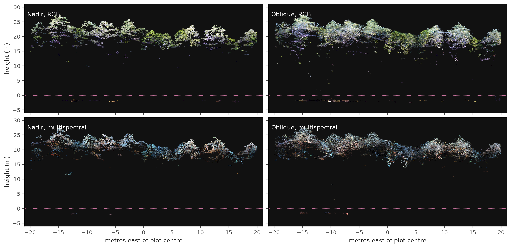
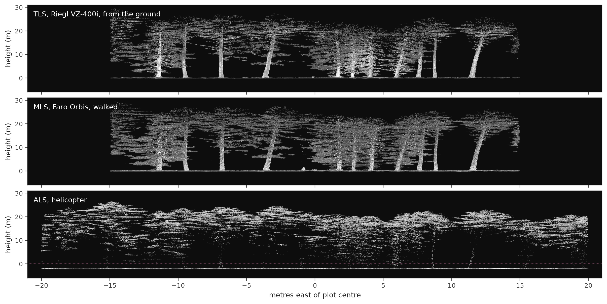

::: {.title}
# What a drone point cloud can measure on a forest plot

One plot. Seven point clouds. Seventy-four surveyed stems.

José M. Beltrán-Abaunza &nbsp;·&nbsp; jose.beltran@mgeo.lu.se &nbsp;·&nbsp; Lund University 
NOVA 2026, Point cloud processing for forestry &nbsp;·&nbsp; individual project

:::

## Background

From above

- **ALS** has been used in forest inventory since 2002
- **Drone photogrammetry** is cheap and gives canopy height, but less information on forest density than laser
- A canopy height model **only sees the top surface**

From below

- **TLS** is precise but suffers from occlusion
- **MLS** is faster but less accurate
- Stems are found by **fitting circles to slices**
- Typical requirement: DBH within **0 to 2 cm**

SLU (2016); Liang et al. (2016); Holvoet et al. (2025); Olofsson et al. (2014); course lectures by Lindberg, Bohlin, Yrttimaa and de Paula Pires (2026).

## Aim and questions

My aim: find out what a drone point cloud can measure on a forest plot, and how that depends on the flight.

- **RQ4.** How does flight geometry change the reconstructed canopy, and do tree attributes follow?
- **RQ5.** What can a drone cloud measure compared with laser scanning and the field data?

Plot 167, Remningstorp: owned by Hildur &amp; Sven Wingquists stiftelse, managed by Skogssällskapet, and a long-term SLU test site. Four drone clouds (nadir and oblique, RGB and multispectral), TLS, MLS and helicopter ALS, and 74 field-surveyed stems. The spectral questions RQ1 to RQ3 are left out for this course.

## One plot, seven acquisitions

## The drone sees only the canopy surface

No ground and almost nothing below 15 m.

## The lasers see what the drone cannot

TLS and MLS see stems and ground. The helicopter sees canopy and ground.

## Same trees, very different clouds

Median return height: 1.3 m TLS, 5.9 m MLS, 17.5 m ALS, about 20 m drone. Canopy p95: 23.6 to 23.8 m drone, 23.77 m ALS.

## An error only a second instrument could find

| ALS terrain vs MLS ground | median | RMSE |
|---|---:|---:|
| before | +2.089 m | 2.100 m |
| after one constant | 0.000 m | **0.079 m** |

513,390 MLS ground points.

2.089 m

Every drone tree height would have been that much **too tall**.

The drone clouds have **no ground** to check against.

## RQ4: flight geometry changes crowns, not heights

| nadir minus oblique | RGB | MS |
|---|---:|---:|
| tree height | +0.10 m | -0.16 m |
| crown area | -1.8 m² | -2.0 m² |

- **Height transfers**: 0.1 to 0.2 m on 22 m trees
- **Oblique crowns are a third larger**: 22.0 vs 16.7 m²
- Oblique has **26 to 45 % more points**

## RQ4 and RQ5: tree detection

| F1 | whole plot | 30 by 30 m box |
|---|---:|---:|
| Nadir RGB | **0.815** | 0.738 |
| Oblique RGB | 0.780 | 0.723 |
| ALS helicopter | 0.794 | 0.690 |
| TLS, canopy height model | | 0.610 |
| TLS, stem slice | | **0.800** |

- **Nadir beats oblique**, despite fewer points
- **The drone does at least as well as the helicopter lidar**
- Where all have data, **stem detection from below is best**
- For TLS, **the method matters**: 0.610 vs 0.800

Lesson learned: my first comparison scored TLS on the box and the drone on the whole plot. Instruments covering different areas must be compared on the common area.

## Small trees are missed by every sensor

MLS is scored on its own 30 by 30 m box. Precision is above 0.92 over each cloud's own coverage. Recall is limited by suppressed trees under the canopy, so stem counts are underestimated.

## RQ5: stem diameter only from below

TLS against a contemporaneous list: RMSE 1.30 cm. The +3.65 cm bias against the 2011 survey is mostly growth. The drone cannot measure diameter at all.

## Volume did not need the drone

I expected volume to need both views: diameter from below, treetop from above.

| 21 stems | with drone height | without |
|---|---:|---:|
| volume | 0.847 m³ | 0.847 m³ |
| form factor | 0.462 | 0.452 |

TLS already reconstructs **86 %** of these trees.

What the drone adds is **coverage**: TLS and MLS miss **28 %** of the plot.

## What each instrument can measure

| | drone | TLS / MLS |
|---|---|---|
| detection (box) | 0.738 | 0.800 / 0.795 |
| canopy height | yes | under-sampled |
| crown area | depends on flight | no |
| stem diameter | **no** | **1.3 cm** |
| ground | no | yes |

1. Drone canopy height is **robust** and matches ALS.
2. **Nadir** is better for crowns and detection.
3. Stems and ground need **lidar from below**.
4. **Check heights against a second instrument.**

## Limits and assumption

Limits

- Field survey is from **2011**
- Detection tuned on the same reference
- No field reference for volume

Assumption

The nadir and oblique flights were flown **on the same day or at most one day apart**.

So the trees and the season are the same, and the differences are mainly **view geometry**. Light and processing could still differ.

Code and figures: github.com/jobelab/nova-course-2026

