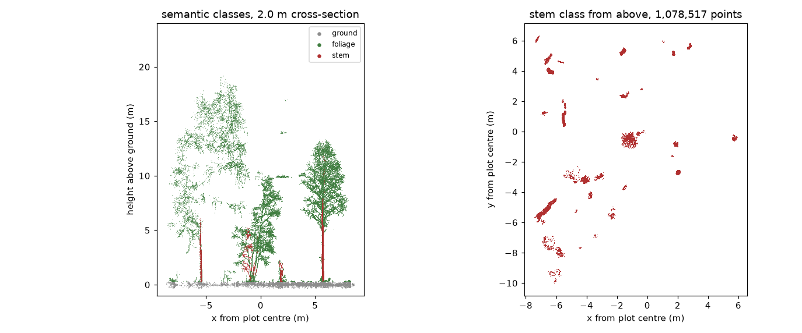
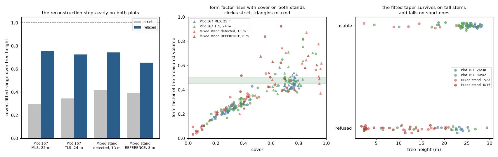

# Day 3: close-range sensing, one TLS plot

Individual tree detection and stem reconstruction from a single terrestrial scan,
following the close-range-sensing session taught by Tuomas Yrttimaa, reimplemented
independently in Python.

Data: `crsot_mixed_stand.laz` and its height-normalised twin, a boreal mixed stand of
**15,595,864 points over 18.0 x 18.8 m**, with **41 reference tree instances** labelled
in a `treeid` field. That reference is what makes the day useful: every method here is
scored rather than admired.

## Notebooks

| notebook | what it covers |
| --- | --- |
| [`00_ground_filtering_csf.py`](00_ground_filtering_csf.py) | noise filtering, CSF ground classification, height normalisation, validated against the course's own `_hnorm` file |
| [`01_tree_instance_segmentation.py`](01_tree_instance_segmentation.py) | two detection methods compared, the weighted stem pre-screen, semantic segmentation, per-tree inspection, taper reconstruction |

Ground grey, stem red, foliage green. The streaks in the plan view are leaning stems
flattened along their own tracked axis: a round blob is a plumb tree, a streak points
the way it leans.

Where the taper section of the notebook leads. Measured cross-sections, the Kozak
function fitted through them, and its extrapolation above the last usable slice.
Rendered from the Day 4 MLS because that is where the three volume variants are
compared, but the reconstruction is the one this notebook builds.

Both notebooks end with a **Results as measured** section carrying the numbers from the
recorded run, so they can be read without executing anything.

The method reference lives one level up in
[`../02_methods_and_equations.py`](../02_methods_and_equations.py), and the demo this
was built alongside is transcribed in
[`../../docs/day03/course-demo-workflow.md`](../../docs/day03/course-demo-workflow.md).

## What this stand taught

**Most of the trees never reach the canopy.** 23 of the 41 reference trees are under
10 m in a stand topping out at 22.8 m, median tree height 7.5 m. That single fact
decides which methods can work here, and it is why a top-down approach struggles.

## Comparing against Yrttimaa's method

`novatrees.chm_watershed` ports the crown-detection stage of **Point-Cloud-Tools**
(PCT) - the MATLAB toolbox by Dr. Tuomas Yrttimaa behind `PCT_demo_installer.exe`
in the course material. It is top-down: CHM → gaussian smooth → local-maxima tree
tops → marker-controlled watershed.

Scored against the reference `treeid` labels in the cloud (41 instances):

| method | seeds | instances | matched of 41 | recall | precision | mean IoU | h RMSE | under-seg |
| --- | ---: | ---: | ---: | ---: | ---: | ---: | ---: | ---: |
| A  CHM watershed (PCT port) | 13 | 13 | 6 | 0.15 | 0.46 | 0.735 | 1.99 m | 7 |
| D  3DFin / dendromatics | 51 | 23 | 16 | 0.39 | 0.70 | 0.673 | 1.96 m | - |
| B  cross-section seeds | 38 | 32 | 24 | 0.59 | 0.75 | 0.790 | 0.87 m | 5 |
| **B+ pre-screened (verticality + reflectance)** | 37 | 36 | **28** | **0.68** | 0.78 | **0.805** | **0.82 m** | **3** |
| C  TreeAIBox learned seeds | 34 | 28 | 22 | 0.54 | **0.79** | 0.805 | 0.95 m | 5 |

Recall is against **all 41** reference trees (`recall_total`), not only those a
prediction happened to overlap - see `novatrees.evaluate` for why that distinction
matters.

Method C swaps our cross-section seeds for TreeAIBox's trained stem detector and keeps
the growing identical, so it isolates the seeding; see [`TREEAIBOX.md`](../../TREEAIBOX.md).
It costs under 3 minutes of CPU for the full plot and still gives the best precision.

**B+ is the best overall**, and that reverses an earlier reading of these results. C
beat B when B clustered the raw cross-section. Adding the course demo's verticality
and reflectance pre-screen lifted B past it - 28 matched trees against 22, and a lower
height RMSE. The learned detector did not get worse; the geometric route got better.

The gap is not a tuning failure, and no CHM parameters close it. **23 of the 41
trees are under 10 m** in a canopy reaching 22.8 m, median tree height 7.5 m - over
half this stand is suppressed. A canopy height model keeps only the highest return
per cell, so a tree beneath a taller neighbour leaves no trace in it. Cross-section
seeding looks at breast height, where a suppressed stem is as visible as a dominant
one.

**Method D is third-party software, not our code.** `novatrees.dfin_bridge` drives
3DFin's algorithmic core, dendromatics, in the order 3DFin's own processing module
calls it, at its shipped defaults except for one cluster-size floor that starves on a
plot this small. It lands between the top-down method and ours, which is roughly what
its design predicts: it seeks stems at breast height like B, but individualises by
distance to a PCA axis, and 51 verticality clusters became 23 trees, so most of the
loss is there rather than in finding stems.

Read that row with care. Its parameters were not tuned here and ours were tuned
against this exact plot for a session, which is a form of overfitting. Its 25 m
`maximum_height` default and its stripe limits are survey conventions, not physics.

Where it agrees with us matters more than where it wins. Its own stem reconstruction
covers a median 24 per cent of tree height at form factor 0.21, against our 30 per
cent and 0.24 before a fitted taper was added. **Two independent implementations
produce the same partial-volume pathology**, which is the strongest evidence that this
is a property of the clouds rather than a defect in our slice acceptance. See
[`../../docs/3dfin.md`](../../docs/3dfin.md).

Note what is being compared: PCT uses crown segments as a *partition* step and then
classifies stem points within each segment. This is one stage of that pipeline
against a complete alternative, not the whole toolbox.

## Reference results

CSF on `crsot_mixed_stand.laz` (TLS, 18.0 × 18.8 m, 15,595,864 points),
cloth 0.2 m, threshold 0.3 m, relief:

| implementation | ground | share |
| --- | ---: | ---: |
| CloudCompare `qCSF` | 3,830,441 | 24.6 % |
| Python `cloth-simulation-filter` | 3,659,893 | 23.5 % |

Ground spans only ~1.03 m across the plot. Tree instance segmentation from our own
CSF normalisation finds **40–41 stems**, against 41 reference instances.

## The second plot for the taper work

This stand is the independent check on everything Day 4 concluded about stem
reconstruction. It is a different stand, a different scanner and a different size
class, and it has something Plot 167 does not: **41 reference tree instances**, so the
taper can be measured without our own segmentation in the way.

| set | n | height | DBH | cover strict | cover relaxed | f strict | f relaxed | f model | models usable |
| --- | ---: | ---: | ---: | ---: | ---: | ---: | ---: | ---: | ---: |
| Plot 167 MLS | 38 | 25.2 m | 0.300 | 0.30 | 0.75 | 0.24 | 0.44 | 0.49 | 26/38 |
| Plot 167 TLS | 42 | 23.8 m | 0.285 | 0.35 | 0.73 | 0.27 | 0.46 | 0.51 | 30/42 |
| Mixed stand, detected | 23 | 12.8 m | 0.185 | 0.42 | 0.74 | 0.34 | 0.48 | 0.52 | 7/23 |
| **Mixed stand, reference labels** | 16 | 8.3 m | 0.097 | 0.39 | 0.65 | 0.40 | 0.56 | - | **0/16** |

**The coverage artefact transfers, and it is not our segmentation.** The strict
settings cover 0.30 to 0.42 of tree height on every set including the reference-labelled
one, and relaxing them reaches 0.65 to 0.75 everywhere. Two stands, three sensors, and
stems from 8 m to 25 m all behave the same way.

**Form factor against cover is one curve.** The middle panel puts all four sets on the
same rising relationship, which is the strongest evidence available that a low form
factor measures how much stem was reconstructed rather than anything about the tree.

**The fitted taper does not transfer to small trees.** This is the new limitation, and
it is sharp: 26 of 38 usable on 25 m stems, 7 of 23 on 13 m ones, and **0 of 16** on
the 8 m reference stems. The refusals are not marginal. Predicted tip diameters come
back at 10^9 to 10^12 times the last measured diameter, because a four-coefficient
Kozak form on a short, thin, partly-covered stem is under-determined.

So the modelled whole-stem volume is a **dominant-tree** quantity. That is coherent
with how it is used, since the airborne sensor only sees dominant trees anyway, but it
means the model column cannot be used to value a suppressed understorey, and the
measured columns are the only ones that work across the whole size range.

## Findings worth carrying forward

**Height normalisation is sensitive to the per-cell DTM statistic.** The textbook
minimum is biased low by sub-surface noise: +0.264 m against the course's own
normalisation, RMSE 0.275, of which 96 per cent is bias rather than scatter. Quantile
0.25 gives bias -0.002 m and RMSE 0.068.

**Merged instances are a seeding failure, not a growing failure.** The largest
predicted tree swallowed two reference trees whole because only one of them had a
seed. No graph parameter fixes that; better seeds do.

**Reflectance is the strongest single feature.** Bark and foliage sit about 9 dB
apart here, which is a far cleaner separation than verticality gives, and it was the
field we had ignored longest.

**Stems 0.31 m apart merge at the default clustering radius.** Predicted tree 12 was
three reference trees, because two of its stems were closer together than the DBSCAN
neighbourhood. Filtering the slice on shape and reflectance separates them without
shrinking the radius, which would fragment single stems instead.

**A taper integral is not a stem volume.** It runs between the first and last
*accepted* slice, and returns thin with height until slices stop passing the minimum
point count. The notebook now reports cover, the share of tree height the fit spans,
and the form factor against the DBH cylinder beside every volume. A boreal conifer
holds a form factor near 0.45 to 0.50, so a value near 0.25 is the signature of a
reconstruction that stopped partway rather than a thin tree. Day 4 carries this
further and reports three volumes per tree instead of one.
