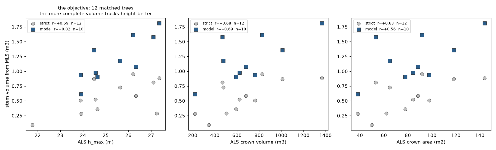

# Day 4: ALS, MLS and TLS over plot 167

The same plot from three platforms, ending in one table: ground-derived stem volume
beside airborne metrics.

## The exercise

1. Preprocess high density ALS over plot 167
2. Run tree detection and segmentation on the ALS
3. Extract metrics from the ALS
4. Detect trees in TLS and MLS over the same area
5. Estimate stem volume for every detected tree
6. Match ALS and ground-based tree positions

Objective: a data frame with TLS/MLS-derived stem volume beside ALS-derived metrics.
The regression that would upscale volume across the wider ALS coverage is separate
work and is deliberately not fitted here.

Step 5 turned out to be the one with a trap in it, and it has its own section below:
**the taper integral is not a stem volume**, so the table carries three volume columns
per tree rather than one.

## Notebook

[`00_multisensor_inventory.py`](00_multisensor_inventory.py) runs all six steps, with
both the heuristic and the learned detector. It also carries the measured results as a
static section at the end, so the numbers are readable without a ninety-minute pass.

**Semantic segmentation, side by side.** Between steps 4 and 5 the notebook classifies
every point as ground, stem or foliage and draws the three sensors against each other:
a cross-section over the same 30 m of ground, and the stem class from above. The ALS
panel has no stem class in it, because a helicopter never records bark, and what it
offers instead is a canopy apex twenty metres above the stem. That single figure is the
argument for the whole exercise.

## Data

| | ALS helicopter | MLS | TLS |
| --- | ---: | ---: | ---: |
| points | 11,205,212 | 61,020,343 | 290,336,075 |
| plot radius | 30 m | 15 m | 15 m |
| density | ~3,000 /m2 | ~68,000 /m2 | ~323,000 /m2 |
| Z datum | absolute | absolute | **not georeferenced** |
| stems visible | no | yes | yes, richly |

Reference: Hyyppä et al. (2020), *Under-canopy UAV laser scanning for accurate forest
field measurements*, <https://doi.org/10.1016/j.isprsjprs.2020.03.021>

## Four things this data forces

**The method has to change with the sensor.** ALS switches to CHM watershed, because a
helicopter cannot see a stem under closed canopy and cross-section seeding has nothing
to cluster. On the Day 3 TLS plot the ranking was the exact reverse, watershed at
recall 0.15 against 0.68. Neither method is better in general; they answer to
different data. `novatrees.presets` encodes that, and the important line in it is
`ALS.seed_method = "chm"`.

**The TLS is not georeferenced in Z.** Its heights read -2.5 to 27.9 m while the other
two sit at 135 to 166 m. Normalised height is the only datum the three share, so
normalisation is a correctness requirement here rather than a convenience.

**All three are circular cookie cuts** on a common centre. The cutter slices through
whatever crowns and stems straddle the boundary, so edge trees are measured from a
fraction of themselves and their volume is biased low irreversibly. They are flagged,
not corrected: correcting would mean assuming a shape.

**Position means different things to each sensor.** The ground locates a tree by its
stem base, the air by its canopy apex. On leaning or asymmetric trees those differ by
metres, and that offset is a real property of the measurement, not an error to tune
away.

## Reading the tree counts

Heuristic detector, 8 M points per cloud:

| | points read | trees | on edge | time |
| --- | ---: | ---: | ---: | ---: |
| ALS | 2.8 M | 92 | 15 | 22 s |
| MLS | 7.6 M | 38 | 7 | 50 s |
| TLS | 7.8 M | 48 | 9 | 66 s |

The two ground sensors agreeing at 38 and 48 while ALS reports 92 is the expected
shape. ALS is fragmenting crowns, not finding trees the ground missed, since a
helicopter cannot see a stem the scanner was standing beside.

Learned detector, same clouds: MLS 39 trees in 1,324 s, TLS 35 in 4,894 s. It finds
the same number of trees as the heuristic on MLS and fewer on TLS, at roughly thirty
and seventy times the cost, all on CPU. Fewer of them survive to a volume, 23 against
38 and 42, because its stem masks are thinner.

**Twenty-six of those 92 are debris**, not suppressed trees: slivers of a few
returns caught between two watershed basins. They matter because they are
*positions*, and a sliver near a real stem wins the nearest-neighbour match and
brings a nonsense height with it. `novatrees.drop_fragments` removes them, which
took the matched height RMSE from 10.88 m to 2.09 m. The thresholds are loose on
purpose: every combination from 5,000 to 30,000 points, 5 to 15 m and 5 to 20 m2
returns the same twelve matched trees, so they cut debris rather than select trees.

Both ground sensors are carried through to volume rather than one, because where TLS
and MLS disagree that disagreement is the honest error bar on the whole exercise. Two
independent instruments agreeing is worth more than either one's internal fit
statistics.

## Step 5 in detail: a taper integral is not a stem volume

The volume in the first version of this table was wrong, and the error is worth
keeping on the page because it is invisible in the formula.

$$V = \int_{z_0}^{z_1} \pi \left( d(z)/2 \right)^2 dz$$

$z_0$ and $z_1$ are the first and last **accepted** slice. Returns per stem thin with
height until slices fall below the minimum point count and the chain stops, usually
in the lower canopy. On MLS the strict PCT thresholds reach a median of 30 per cent
of tree height, so what was reported as stem volume was the volume of the lower
third of the stem.

**The check that catches it costs nothing.** Divide by the cylinder that DBH and
height give, $f = V / \pi (D_{1.3}/2)^2 H$. A boreal conifer stem holds $f = 0.45$ to
$0.50$. The original column sat at 0.24.

`novatrees.taper.volume_variants` now reports all three answers per tree. MLS with
the heuristic detector, 38 trees, medians:

| | volume | cover | form factor | what it claims |
| --- | ---: | ---: | ---: | --- |
| measured, strict (PCT thresholds) | 0.407 m3 | 0.30 | 0.24 | the lower third of the stem, measured |
| measured, relaxed thresholds | 0.772 m3 | 0.75 | 0.44 | three quarters of the stem, measured, noisier |
| Kozak model, integrated $0$ to $H$ | 0.981 m3 | 1.00 | **0.49** | the whole stem, extrapolated above the slices |
| cylinder $\pi (D_{1.3}/2)^2 H$ | 1.769 m3 | | 1.00 | the bound no stem reaches |

The model column covers 26 of the 38 trees. The other twelve had fits that did not
close at the tip and were refused rather than clamped, which is the subject of the
stem-profile figure above.

Median DBH 0.300 m, median height 25.2 m.

**All four runs say the same thing**, which is the part that makes it believable.
Two sensors, two detectors, medians:

| run | trees | strict | cover | f | relaxed | cover | f | model | f | model usable |
| --- | ---: | ---: | ---: | ---: | ---: | ---: | ---: | ---: | ---: | ---: |
| MLS heuristic | 38 | 0.407 | 0.30 | 0.24 | 0.772 | 0.75 | 0.44 | 0.981 | **0.49** | 26/38 |
| TLS heuristic | 42 | 0.308 | 0.35 | 0.27 | 0.643 | 0.73 | 0.46 | 0.763 | **0.51** | 30/42 |
| MLS learned | 23 | 0.139 | 0.17 | 0.18 | 0.522 | 0.74 | 0.47 | 0.826 | **0.51** | 11/23 |
| TLS learned | 23 | 0.176 | 0.27 | 0.22 | 0.532 | 0.70 | 0.45 | 0.695 | **0.53** | 18/23 |

The strict column varies by a factor of three across runs because it is measuring
different amounts of stem, not different trees. The relaxed column collapses that
spread to 0.44 to 0.47, and the model column to **0.49 to 0.53**. Four runs that
disagree on the raw number and agree on the ratio is exactly what a coverage artefact
looks like once it is corrected.

**The last column is the price.** Only 26 of 38 trees get a model volume on MLS, and
11 of 23 on MLS learned. A fitted taper that does not close at the tip is refused
rather than clamped flat, so fewer trees carry a whole-stem estimate and the ones that
do are defensible. An earlier version clamped instead and reported 38 of 38, with the
MLS learned form factor at 0.60 rather than 0.51. The extra twelve trees were
cylinders running to the treetop.

Read the three rows as one argument. Loosening the thresholds is not a fudge: cover
goes from 0.30 to 0.75 and the form factor moves from 0.24 to 0.44, which is measured
stem that the strict settings refused to integrate rather than volume invented by the
parameters. The model then adds the part above the highest usable slice and lands at
0.50, exactly where forestry says a boreal conifer belongs. Three independent routes
converging on the same place is the reason to believe the last one.

**What each is for.** The strict column is what the scanner saw and is the one to
quote when the question is measurement. The model column is the one to carry into a
regression against ALS metrics, because ALS crown metrics respond to the whole tree.
The relaxed column is the bridge that shows the other two are consistent.

The stem profile is where the three columns become one picture. Grey circles are the
cross-sections accepted at PCT's thresholds, blue triangles the relaxed ones, the
solid line is the Kozak function fitted through them, and the dashed line is where it
is extrapolating above the last usable slice. Shaded area is stem that was never
measured.

**The third panel is a fit being refused.** Its curve does not close at the tip: the
predicted diameter at the top is 0.998 of the diameter at the last measurement, so
the model would have run a 0.16 m cylinder from 18.6 m to the tree top and charged
the volume for it. Its form factor came out at 0.60 where its neighbours hold 0.44 to
0.48. Clamping such a fit to be non-increasing does not repair it, it disguises it,
so the volume is refused instead. The two tests are that the curve must close,
$d(0.999H) \le 0.5\,d(z_1)$, and must not widen with height.

### The numbers behind the numbers

Nothing here used half-metre sections. Every reported volume came from these:

| | strict | relaxed | 3DFin |
| --- | ---: | ---: | ---: |
| slice thickness | 0.10 m | 0.20 m | 0.05 m |
| **step between cross-sections** | **0.08 m** | **0.20 m** | **0.20 m** |
| minimum points per slice | 100 | 15 | n/a |
| RANSAC distance threshold | 0.04 m | 0.06 m | 0.02 m |
| radius tolerance between slices | 0.03 m | 0.09 m | n/a |
| centre tolerance | 0.06 m | 0.15 m | n/a |
| RANSAC iterations | 2000 | 2000 | n/a |
| diameter accepted | 0.02 to 3.0 m | 0.02 to 3.0 m | 0.06 to 1.0 m |

The strict column is PCT's Phase 5 as taught: cross-sections every 8 cm through a
10 cm slab, so consecutive slabs overlap. `presets.ALS.taper` does carry a 0.50 m
step, but `run_sensor` never consumes it, so no result here used it.

**DBH is not a slice.** It is the fitted Kozak curve evaluated at exactly 1.3 m, so it
does not depend on a slice landing at breast height. Without a fitted model it falls
back to interpolating the smoothed curve there. 3DFin instead has `tree_locator` pick
the best-quality section near breast height, which is one reason the two disagree
tree by tree.

The relaxed settings are `TaperParams.relaxed()`: slices twice as thick, steps two
and a half times longer, the minimum point count cut to 15 per cent, and the
between-slice tolerances widened. The defaults they replace are PCT's, and PCT is a
TLS tool: 100 points in a 0.10 m slice is easy at 323,000 points per square metre and
impossible on MLS returns eight metres up.

**The model is refused rather than trusted blindly.** Kozak's exponent carries a log
term, so extrapolating below the lowest slice can run the predicted diameter away by
orders of magnitude. The fit is extrapolated upward only, capped at two and a half
times DBH, forced not to widen with height, and discarded outright when the cap binds
on more than a tenth of the profile. Below the lowest slice the volume is a cylinder
at the last measured diameter, which understates butt swell slightly and cannot
explode.

## Step 6 and the objective: the joined table

`out/day04/FINAL_joined_MLS_ALSfiltered.csv`, twelve trees matched between the MLS
heuristic run and the fragment-filtered ALS, median position offset 0.53 m:

| ground | air |
| --- | --- |
| tree id, stem x and y | matched ALS tree id, apex x and y |
| total height | h_max, h_p99, h_p95, h_p75, h_p50, h_p25, h_mean, h_std |
| DBH, strict and relaxed | crown area, crown volume, crown base |
| **three volumes**, each with cover and form factor | fraction of returns above mean height, point count |
| | distance to plot edge, edge flag, match distance |

Every volume variant is kept in the row rather than one being chosen, so anything
fitted on this table has to declare which it used.

**How the four runs match:**

| run | matched | median offset | height RMSE against ALS |
| --- | ---: | ---: | ---: |
| MLS heuristic | 12 | 0.53 m | **1.31 m** |
| TLS heuristic | 12 | 0.59 m | 6.34 m |
| MLS learned | 7 | 0.57 m | 1.51 m |
| TLS learned | 8 | 2.34 m | 2.41 m |

TLS heuristic matches as many trees as MLS and then disagrees with the air about their
height by 6.34 m. That is the occlusion signature: a tripod sees the lower stem in
detail and loses the top of the crown behind everything in front of it, so its tree
tops are too low. MLS, walking through the plot, sees the same crown from several
sides. **Density is not the same as coverage,** and TLS has four times the density of
MLS here.

### The volume that is more complete correlates better

Correlation with ALS metrics across the twelve matched trees, one column per volume
variant:

| ALS metric | strict (n=12) | relaxed (n=12) | model (n=10) |
| --- | ---: | ---: | ---: |
| h_max | +0.590 | +0.752 | **+0.822** |
| h_p99 | +0.495 | +0.676 | **+0.763** |
| crown volume | +0.680 | +0.724 | +0.689 |
| crown area | +0.625 | +0.649 | +0.565 |

The model column covers ten of the twelve trees; the other two had their fits refused.
Refusing them **raised** the height correlation, from +0.791 to +0.822, which is a
second independent argument that the refusal is right: the ALS knows nothing about the
taper, so a rule that improves the agreement is removing noise rather than data.

This is worth more than it looks. Nothing in the taper reconstruction knows about the
ALS, so the ALS correlations are an independent test of which column is closest to the
truth. Against the height metrics the ordering is unambiguous and in the expected
direction: a helicopter measures the top of the tree, so a volume that includes the
upper stem should track it better than one that stops a third of the way up, and it
does, +0.59 to +0.79.

Against crown metrics the three are indistinguishable, which is also expected, since
crown size responds to competition and growing space rather than to the length of the
stem underneath it.

The form factors of these twelve trees fall between 0.436 and 0.526, median 0.49.

**This is where the exercise stops.** Fitting the regression that would upscale volume
across the wider ALS coverage is the next step and is deliberately not done here:
twelve trees from one plot would produce a demonstration, not a model.

## Against the earlier course pipeline

The exercises from the earlier sessions live in the sibling package `pcf`, a Python
reimplementation of the lidR route: CSF or morphological ground, **TIN** height
normalisation, variable-window tree tops, then Dalponte 2016 or Silva 2016 crowns.
`novatrees.pcf_bridge` runs it beside this one rather than choosing between them,
because they were built for different data and it shows.

**Height normalisation, on dense TLS.** Scored against the course's own normalised
copy of the Day 3 cloud, point for point:

| | bias | RMSE |
| --- | ---: | ---: |
| `novatrees`, DTM quantile 0.25 per 0.5 m cell | -0.0025 m | 0.0685 m |
| `pcf`, TIN through the ground returns | -0.0662 m | 0.1535 m |

Ours wins here, and the reason is the data rather than the algorithm. Ground returns
under a TLS scanner are dense enough that a per-cell quantile has plenty to work with,
while a TIN triangulates through whatever low vegetation survived classification and
carries it into the surface. On sparse airborne ground returns the argument reverses,
which is why both are kept.

**ALS tree detection, inside the 15 m ground plot** where the two ground sensors give
a reference count:

| | objects over the ALS footprint | inside the plot | median crown area |
| --- | ---: | ---: | ---: |
| `pcf`, variable window 3 m + Dalponte 2016 | 118 | **25** | 26.0 m2 |
| `novatrees.chm_watershed` | 92 | 20 | 57.6 m2 |
| ours after `drop_fragments` | 53 | 13 | 84.1 m2 |
| ground reference (MLS / TLS stems) | | **38 / 48** | |

`pcf` is closer, and its crowns are the right size while ours are roughly twice too
large, which is the signature of a watershed basin merging neighbouring crowns. Its
seeding is also better suited: a variable window scaled to canopy height separates
adjacent tops that one fixed smoothing kernel runs together.

**Both undercount by a factor of two.** That is not a tuning failure either. The same
stand that made a CHM fail on Day 3 is here: over half the stems are suppressed, and
a helicopter records the crown that shades them, not the tree. No airborne method
recovers a tree that left no return.

**This is now wired in.** `run_sensor(..., detector="pcf")` runs `pcf`'s chain on our
normalised heights, so only the segmentation differs, and its crown raster becomes the
per-point labels directly. Measured against the ground stems:

| | ours, watershed | `pcf`, dalponte2016 |
| --- | ---: | ---: |
| crowns inside the 15 m ground plot | 13 | **25** |
| median crown area | 84.1 m2 | **29.8 m2** |
| stems per occupied crown | 2.64 | **1.31** |
| stems the ALS accounts for | 34 % | **63 %** |

Our crowns were roughly three times too large, each swallowing two or three stems.
Everything downstream inherited that: the fitted height exponent moved from 1.48 to
2.21, which is what a cone predicts, and the volume expansion ratio fell from 1.60 to
1.06. See [`../day05/README.md`](../day05/README.md).

The division of labour is therefore `pcf` for the ALS crown step and `novatrees` for
normalisation on the ground clouds and everything below breast height.

## On the learned detector

TLS and MLS use TreeAIBox's **boreal** stem classifier and tree locator, which suit
this forest.

ALS uses the **reclamation-site** models, because those are the only published ALS
weights, and the released ALS set has no stem classifier at all. That run is a
domain-transfer test, not a like-for-like comparison, and it is labelled as such
wherever its numbers appear.

## Noise, including mist

Mist deserves separate mention because it does not behave like other noise. Droplets
hanging around stems are **diffuse rather than isolated**, so a statistical filter
finds each droplet well-connected to its neighbours and keeps it, and raising the
threshold removes real sparse canopy first. Two things do work: a radius filter at a
scale wider than the droplet spacing, and the reflectance screen, since atmospheric
returns fall below both bark and foliage.

Having two sensors over one plot makes the filter checkable rather than trusted. ALS
puts the canopy top at 162.72 m over the MLS footprint, and MLS carries 5,853 points
above that height, which nothing in the plot can explain except noise.
